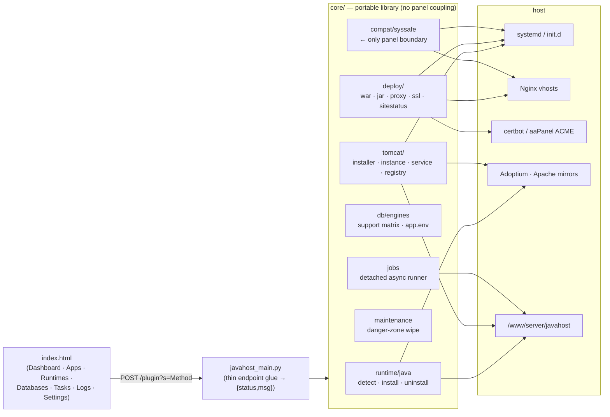

# JavaHost — Tomcat & Java Runtime Manager for aaPanel/BaoTa

[](https://github.com/yashodhank/aaPanel-tomcat-plugin/actions/workflows/ci.yml)
[](https://github.com/yashodhank/aaPanel-tomcat-plugin/actions/workflows/release.yml)
[](https://github.com/yashodhank/aaPanel-tomcat-plugin/releases)
[](LICENSE)
<br>


An **independent, open-source** aaPanel/BaoTa-style plugin to install and manage
**Apache Tomcat 9 / 10.1 / 11** and **Java 8 / 11 / 17 / 21**, deploy WAR and
Spring Boot / executable-JAR apps, publish them on a domain with **per-site
Let's Encrypt HTTPS**, and connect them to **PostgreSQL / MySQL / MariaDB /
MongoDB** — all with integrity-verified downloads, systemd services, and async
background jobs. It ships a self-contained admin UI (Dashboard · Applications ·
Runtimes · Databases · Tasks · Logs · Help · Settings) with a fullscreen mode.

> **Why this exists:** the panel's built-in Java manager stalled at Tomcat 7/8/9.
> JavaHost adds modern Tomcat 10/11 + Java 17/21 the right way, as a clean,
> maintainable community plugin.

## Independence & licensing

JavaHost is a **clean-room** implementation. It is **not** a fork of aaPanel's
proprietary `tomcat2` plugin and contains **no aaPanel source code, UI, or
assets**. It interoperates only through the panel's public, documented
third-party plugin API (which the AAPANEL license §3.1 explicitly permits for
independently-developed plugins). Licensed under **Apache-2.0** — see
[`LICENSE`](LICENSE) and [`NOTICE`](NOTICE).

Third-party runtimes (Apache Tomcat, Eclipse Temurin/OpenJDK, PostgreSQL JDBC)
are **downloaded and integrity-verified at runtime**, not bundled.

## How it works

JavaHost is **host-local**: a single-file UI (`index.html`) talks to a thin
Python entrypoint (`javahost_main.py`) over the panel's documented convention
`POST /plugin?action=a&name=javahost&s=<Method>`, which delegates to a
panel-agnostic `core/` library. The only place that touches anything
aaPanel-specific is `core/compat/` — everything else is portable Python that
drives **systemd/init.d**, **Nginx**, **certbot**, and the **Adoptium/Apache**
download mirrors.



An app goes from creation to a published, TLS-terminated endpoint with a database
in five endpoint-backed steps — **Create** (`CreateApp` → scaffold
`CATALINA_BASE`, resolve the JDK, render a loopback `server.xml`, write the
systemd unit, start) → **Deploy** (`UploadWar`, zip-slip-safe) → **Publish**
(`SetSite` → Nginx vhost at `<app>.<site_suffix>`) → **HTTPS** (`SetSiteSSL` →
aaPanel-native ACME, **certbot `--webroot` fallback**) → **Connect**
(`SetDbEnv` → secret-safe `app.env`). Long-running actions (installs,
Start/Stop/Restart) run as **detached background jobs** so a slow systemd
transition can't time out the panel; the UI polls `GetJobs`/`GetJobLog` and
surfaces them in **Tasks**. See [Architecture](docs/architecture.md) and the
[User Guide](docs/user-guide.md) for the full diagrams (deploy lifecycle, async
job flow, SSL decision, and the status-semantics model).

## Features

| Area | What you get |
|------|--------------|
| Tomcat | 9 (legacy `javax`), 10.1, 11 (both `jakarta`) — dynamic latest-patch resolution, **SHA-512 + OpenPGP verified** downloads; install / **update** / **uninstall** |
| Java | Detect 8/11/17/21; install Temurin (verified); **install / reinstall / uninstall** per major as async jobs; uninstall is **blocked while a JDK is in use** (lists dependents; `Force` overrides and stops them); per-runtime `JAVA_HOME`; JVM-flag validation. **Self-contained:** manages only its own JDKs under `runtimes/` (+ distro `/usr/lib/jvm`) — it does *not* reuse aaPanel's `/usr/local/btjdk` |
| Apps | Rich Applications list + slide-over detail **drawer** (Overview / Logs / Metrics / Config / Database); type (WAR / Spring Boot JAR / Tomcat), runtime chip, status badge, **health pill**, a **"runtime missing"** badge when a pinned JDK is gone, **async** Start/Stop/Restart, an **Open ↗** proxy link, and a **per-site HTTPS toggle**. Create app accepts a **JDK pin** |
| Services | **systemd** units (init.d fallback); `JAVA_HOME` via env, never parsed from a shebang; async lifecycle via background jobs so slow systemd transitions can't time out the panel |
| Security | manager/examples/docs removed by default, AJP off, shutdown port disabled, runs as `www`, configs `0640`/secrets `0600`; app connectors bind **127.0.0.1** (loopback) — reachable only via the reverse-proxy domain; init.d no longer shell-sources `app.env`; secrets never echoed |
| Deploy | zip-slip-safe WAR extraction; `javax`→`jakarta` namespace detection & warnings + one-click migrate for Tomcat 10/11; Spring Boot / executable-JAR apps run as services |
| Proxy / SSL | plugin-owned Nginx vhost generator (never edits other plugins' configs); sites at `<app>.<site_suffix>` (the suffix is a **plugin config**, empty by default — the UI prompts, no FQDN hardcoded); **per-site Let's Encrypt HTTPS** via `SetSiteSSL` (aaPanel-native ACME → **certbot `--webroot` fallback**, 443 vhost + 80→443 redirect + auto-renew hook, cert kept on disable); on-demand cert/site status (`GetSiteStatus`) surfaced in the drawer's **Site & SSL** block |
| Databases | **PostgreSQL (9.4–18), MySQL (5.5–9.x), MariaDB (10.2–11.x), MongoDB (3.6–8.0)** — a support-matrix reference, per-app DB-env form with a live **search/filter**, connection-URL builder, JVM→driver matrix, secret-safe `app.env` (no creds in WAR/URL/logs); the drawer shows the current env (`GetDbEnv`, **never** the password) |
| Backup / restore | Per-app **backup** (config + webapp + DB env + vhost + manifest; excludes logs and **never** LE private keys) and **restore** — in place or as a **new app** (reallocated port, domain remap, SSL re-issued). **Remote object storage** (Wasabi / MinIO / B2 / R2 / AWS) via a dependency-free S3 SigV4 client (custom endpoint; secret-safe `0600` config). **Scheduled backups** with local + remote **retention** (managed `cron.d`), and **restore-from-upload** through the hardened tar extractor (symlink/traversal/device rejection) |
| Dashboard | Live operational aggregates (`GetDashboard`, lazy-loaded): apps running / down / **runtime-missing**, aggregate **CPU % + RSS**, **certs expiring <30 days**, instances/backups **disk usage**, and recent tasks |
| Observability | **Tasks** (background-job status: install/uninstall/lifecycle — running/done/failed + view-log) and **Logs** (unified app + task log viewer) |
| Maintenance | **Settings → Danger zone:** granular wipe (apps / jdks / tomcats / sites / full) with dry-run preview + typed `WIPE` confirm; wipe **skips runtimes still in use**; `install.sh uninstall` honors a saved plan (default keep-data) |
| Lifecycle | idempotent install, atomic staging + rollback, disk precheck, managed-marker uninstall; runs safely under aaPanel System Hardening (lift/re-lock the immutable bit) |

## Documentation

- [User Guide](docs/user-guide.md) — task-oriented walkthrough of the UI
  (install, runtimes, apps, WAR/JAR deploy, databases, proxy, per-site HTTPS,
  Tasks/Logs, Settings/Danger zone, hardening).
- [Endpoint reference](docs/endpoints.md) — every plugin method (params,
  returns, sync/async) the UI calls.
- [Backup, restore & remote storage](docs/backup-restore.md) — what a backup
  captures, overwrite vs restore-as-new, S3/Wasabi remote storage, scheduled
  backups + retention, and restore-from-upload safety.
- [Architecture](docs/architecture.md) — entrypoint, `core/` module map, the
  single panel-compat boundary, data directories.
- [Java runtime](docs/java-runtime.md) — JDK detection, install/reinstall/
  uninstall, dependency rules, the self-contained `runtimes/` model.
- [Connecting Java apps to databases](docs/databases-java-apps.md) — engines,
  drivers, the secret-safe `app.env`, `SetDbEnv`/`GetDbEnv`.
- [System Hardening](docs/system-hardening.md) — runs safely under aaPanel
  System Hardening; auto lift/re-lock with the `manage_hardening` toggle; the
  three-layer model and `AllowServices`.
- [Single-host vs. multi-server](docs/single-vs-multi-mode.md) — JavaHost is
  host-local; install it on each host that should run Java apps.
- [Testing runbook](docs/testing.md) and the full on-box
  [Test campaign](docs/testbed.md) — sample artifacts, WAR/JAR/migrate/DB +
  reverse-proxy/HTTPS walkthrough, plus the opt-in CI deploy matrix.
- [Troubleshooting](docs/troubleshooting.md) — download/verify, service,
  hardening, loopback, and deploy errors.

## Compatibility

- Panels: aaPanel / BaoTa-style (Python 3 plugin runtime).
- OS: Ubuntu 22.04 / 24.04 (primary), Debian 11/12; EL (Rocky/Alma) best-effort.
- Tomcat 10.1 needs Java 11+, Tomcat 11 needs Java 17+ (enforced).

## Install

**ZIP import (recommended):** download `javahost.zip` from
[Releases](https://github.com/yashodhank/aaPanel-tomcat-plugin/releases) →
aaPanel → App Store → Third-party → Import Plugin.

**From source (your own panel):**
```bash
make deploy VPS_HOST=root@your-server   # rsync plugin/javahost + restart panel
```

## Repository layout

```
plugin/javahost/            # the deployable plugin (everything the panel needs)
├── info.json               # manifest (name: javahost)
├── javahost_main.py        # aaPanel entrypoint (thin glue)
├── index.html  icon.svg    # original UI + icon
├── install.sh  tomcat_install.sh
└── core/                   # portable library (no panel coupling except core/compat)
    ├── util/  runtime/  tomcat/  deploy/  db/  compat/
tests/                      # offline unit tests (pytest)
docs/audit/                 # design + audit reports
```

## Development

```bash
make test     # py_compile + pytest (offline, no panel needed)
make lint     # shellcheck + py_compile
make zip      # build javahost.zip
```

## Status

Active (`v0.18.0`). The core library, installer, runtimes, Tomcat lifecycle,
WAR/JAR deploy, multi-engine databases, reverse-proxy + per-site HTTPS, async
jobs, the Tasks/Logs/Danger-zone UI, and the offline test suite are all in
place. The latest cycle added a richer operational **Dashboard** and full
**backup/restore** — local + remote (S3/Wasabi) object storage, scheduled
backups with retention, and restore-from-upload through a hardened tar extractor
(see [Backup, restore & remote storage](docs/backup-restore.md)). Deploy paths
are validated on Ubuntu 24.04 (and via the opt-in CI deploy matrix / the on-box
[Test campaign](docs/testbed.md)). Releases are tag-driven: pushing a `vX.Y.Z`
tag runs `release.yml`, which builds and publishes `javahost.zip`. See
[`CHANGELOG.md`](CHANGELOG.md) for the full history and
`docs/audit/Java_Manager_Plugin_Compatibility_Matrix.md` for the support matrix.

## Contributing

Issues and PRs welcome. Please keep the project clean-room: never paste aaPanel
source, UI, or assets. See `docs/audit/Java_Manager_OSS_Port_Strategy.md`.
