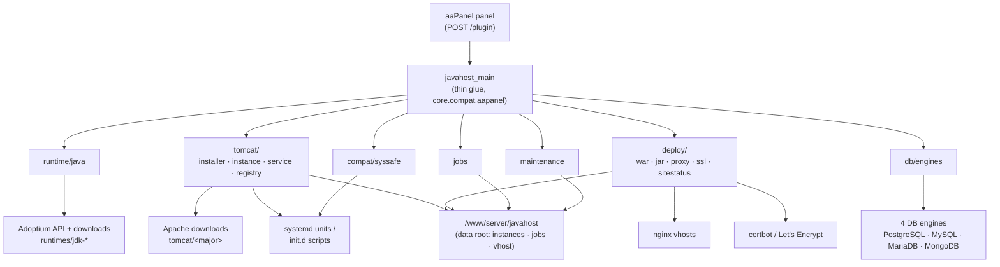
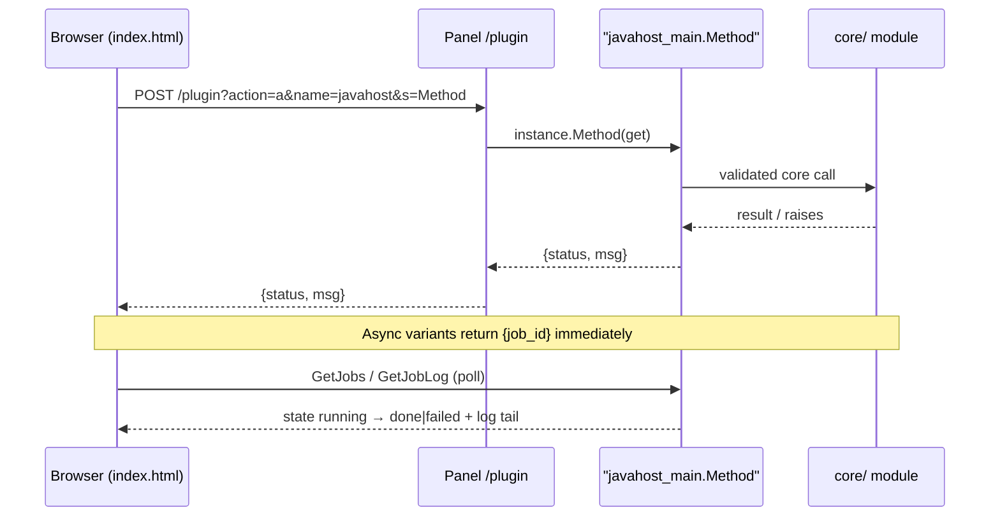
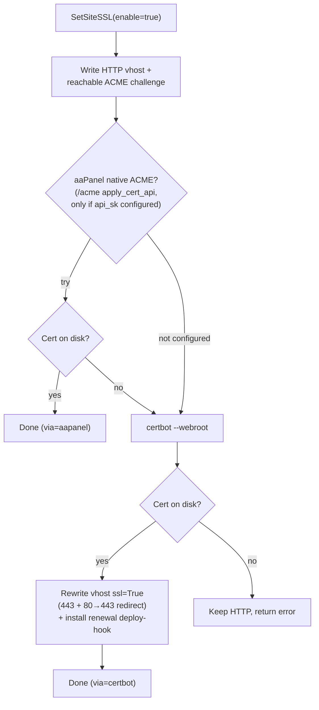
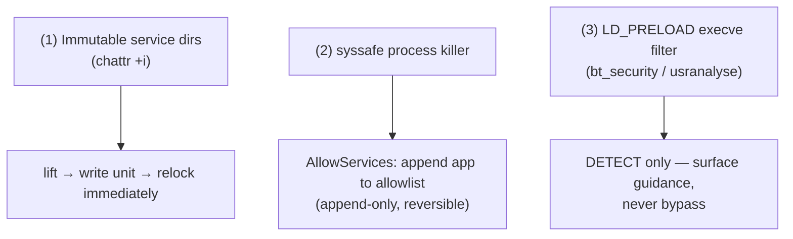

# Architecture

JavaHost is a clean-room, Apache-2.0 plugin that manages Java runtimes and
Apache Tomcat for aaPanel/BaoTa-style panels. It contains no panel source; it
is built only against the panel's public plugin API.

## Entry point

The panel imports `plugin/javahost/javahost_main.py`, instantiates the
`javahost_main` class, and calls `instance.<Method>(get)` where `get` is an
attribute namespace of request params. The entry file is deliberately thin glue
— all real logic lives under `core/`. It prepends its own directory to
`sys.path` so `core` is importable regardless of how the panel loads it.

## Module map (`plugin/javahost/core/`)

- `compat/aapanel.py` — the single panel coupling boundary (see below).
- `util/` — portable helpers:
  - `download.py` — verified downloads (SHA-512 + OpenPGP).
  - `validate.py` — fail-closed input validation for every `get` value
    (identifier, domain, `tomcat_version`, `port`, `java_major`, `memory_mb`).
  - `fs.py` — atomic writes, managed-marker dirs, marker-gated `safe_rmtree`,
    `require_free`, `mkdtemp`.
  - `shell.py` — `which` / `run` command execution.
- `runtime/` — Java layer:
  - `java.py` — JDK detection, `java -version` parsing, Temurin install.
  - `jvm_opts.py` — JVM flag sanitization + safe defaults.
- `tomcat/` — Tomcat layer:
  - `registry.py` — version model + dynamic patch resolution.
  - `installer.py` — verified install / atomic swap / rollback / marker.
  - `service.py` — systemd or init.d unit + `setenv.sh`.
  - `hardening.py` — strip risky webapps, AJP assertion, perms.
  - `instance.py` — per-app CATALINA_BASE lifecycle.
  - `templating.py` + `templates/*.tmpl` — `@@token@@` rendering.
- `deploy/` — app publishing & TLS:
  - `war.py` — zip-slip-safe extract + `javax`→`jakarta` namespace scan + migrate.
  - `proxy.py` — JavaHost-owned Nginx reverse-proxy vhost generation
    (`<app>.<site_suffix>` → loopback port; aaPanel site API preferred).
  - `ssl.py` — per-site Let's Encrypt provisioning: aaPanel-native ACME first,
    `certbot --webroot` fallback, 443 vhost + 80→443 redirect + renewal hook.
  - `sitestatus.py` — on-demand site/cert status (validity, expiry, http/https
    reachability) behind `GetSiteStatus`.
- `db/` — `engines.py` and per-engine `pg.py` / `mysql.py` / `mongo.py`,
  building app DB env files and a support matrix.
- `jobs.py` — detached background-job system (double-fork + setsid) for the
  async install/uninstall/lifecycle endpoints, with per-job state + live log.
- `maintenance.py` — the granular Danger-zone wipe (preview + scoped removal,
  skips in-use runtimes; never touches other plugins or databases).
- `config.py` — plugin config (`manage_hardening`, `site_suffix`, …).

## The single compat boundary

`core/compat/aapanel.py` is the only module allowed to touch panel internals.
It wraps the panel's public helpers (`public.returnMsg`, `public.WriteLog`) and
degrades gracefully when `public` is absent (off-panel unit tests). Everything
else in `core/` stays a clean, portable library that can be re-hosted under a
different panel by swapping this one adapter.

## Data directories (`/www/server/javahost/`)

- `runtimes/` — managed Temurin JDKs (`jdk-8`, `jdk-11`, `jdk-17`, `jdk-21`).
  These are the **only** JDKs JavaHost manages (plus distro JDKs in
  `/usr/lib/jvm` that it merely detects); it does not reuse `/usr/local/btjdk`.
- `tomcat/<major>/` — shared **CATALINA_HOME** per major line (`9`/`10`/`11`).
- `instances/<app>/` — per-app **CATALINA_BASE**.
- `vhost/nginx/` — generated reverse-proxy vhosts.
- `jobs/` — background-job state + per-job logs (running/done/failed).
- `.keys/` — imported Apache KEYS and built GPG keyrings (mode `0700`).
- `config.json` — plugin config; `.uninstall_plan` (optional) — saved Danger-zone
  wipe scope honored by `install.sh uninstall`.

`info.json` `checks` points at `/www/server/javahost` to detect install state.

## Shared CATALINA_HOME + per-app CATALINA_BASE

A Tomcat major is installed once into `tomcat/<major>` (the shared, managed
CATALINA_HOME). Each app is a lightweight CATALINA_BASE under
`instances/<app>` with its own `conf/`, `webapps/`, `logs/`, `work/`, `temp/`,
`bin/`. The base's `bin/setenv.sh` is the single source of truth for env;
`catalina.sh` from the shared home runs against each base via `CATALINA_BASE`.
The pid lives at `<base>/temp/tomcat.pid`.

## Request/response contract

Every method validates its inputs through `core.util.validate` (raising on bad
input) and returns the panel's standard envelope via `core.compat.aapanel`:
`panel.ok(data)` -> `{status: True, msg: data}` and `panel.err(msg)` ->
`{status: False, msg: msg}`. All exceptions are caught at the method boundary
and converted to `panel.err(str(e))`. Mutating actions also call `panel.log`.
Secrets (DB passwords) are never echoed back in responses.

## Diagrams

These render natively on GitHub (Mermaid).

### Component map

The panel only ever touches the thin `javahost_main` glue; every real action is
delegated to a `core/` module, which in turn drives a concrete system target.

### Request flow

Synchronous endpoints return the `{status, msg}` envelope inline. Long-running
endpoints (`StartInstallTomcat`, `StartAppAction`, …) return a `{job_id}` at once
and the UI polls `GetJobs` / `GetJobLog` until the job state leaves `running`.

### SSL provisioning decision (`SetSiteSSL`)

aaPanel's bundled ACME (`sewer`) is broken against pyOpenSSL ≥24 on some hosts —
that is why the certbot fallback exists.

### 3-layer hardening handling

JavaHost coexists with three independent aaPanel protections. It manages the
first two on the operator's behalf and only **detects** (never bypasses) the
third.

