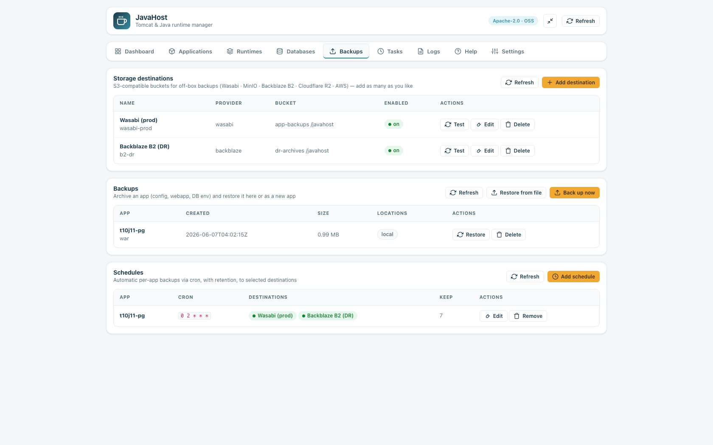
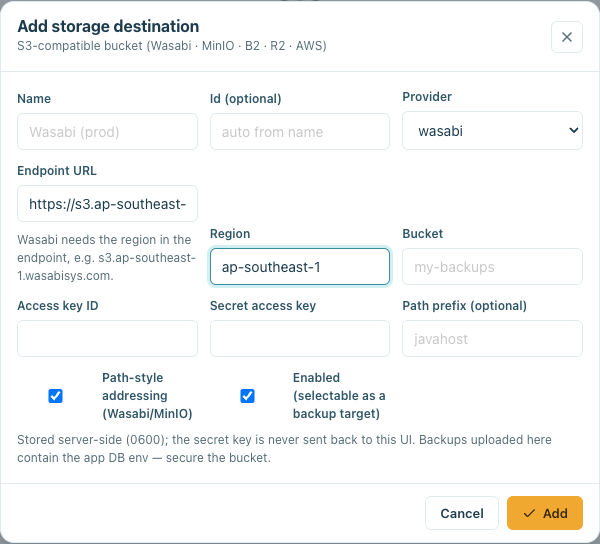
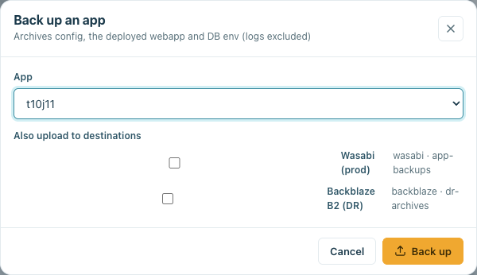

# Backup, restore & storage destinations

JavaHost can archive a deployed app, restore it (in place or as a new app), push
backups to **one or more** S3-compatible **storage destinations**, run them on a
schedule with retention, and restore from an uploaded file. Everything lives under
the dedicated **Backups** tab and runs through the panel-agnostic `core/backup/`
library, the async job system, and one hardened tar extractor.

## What a backup captures

A backup is a gzip tarball `backup-<app>-<UTCstamp>.tar.gz` containing:

- `manifest.json` — app, type (war/jar), Tomcat/Java major, memory, port, domain,
  `ssl_enabled`, db engine, created-at, plugin version. A sidecar `<archive>.json`
  is written next to the tarball so listing is a cheap file read (no gzip open).
- `base/conf/` — `server.xml`, `context.xml`, `web.xml`.
- `base/webapps/` — the deployed app (e.g. `ROOT`).
- `base/bin/` — `setenv.sh`, **`app.env`** (DB credentials), `site.domain`, `site.ssl`.
- `base/app.jar` — for Spring Boot / executable-JAR apps.
- `nginx/<app>.conf` — the plugin-owned reverse-proxy vhost.

**Excluded:** `logs/ work/ temp/`, the systemd/init.d unit (re-rendered on restore —
never unpacked from an archive), and **all of `/etc/letsencrypt`**. TLS **private
keys are never bundled** — the certificate is **re-issued** on restore.

> Backups contain the app's DB credentials (`bin/app.env`), so archives are written
> `0600` under the managed backups dir (`/www/server/javahost/backups`, overridable
> via the `backup_dest` config key). Secure any bucket you upload them to.

## Storage destinations (multiple S3 profiles)

Backups → **Storage destinations**. Add as many S3-compatible **profiles** as you
like — **Wasabi, MinIO, Backblaze B2, Cloudflare R2, AWS**, each a named bucket with
its own endpoint. A dependency-free client (stdlib AWS **SigV4**) talks to any of
them via a custom endpoint.

- Each profile has an `id`, display name, provider, endpoint, region, bucket, access
  key, secret key, optional path prefix, **path-style** toggle (on for Wasabi/MinIO),
  and an **enabled** flag (only enabled profiles are offered as targets).
- The **endpoint is region-aware**: picking a provider (and entering a region) builds
  the correct URL automatically — e.g. Wasabi/AWS/Backblaze need a *region-specific*
  endpoint (`s3.<region>.wasabisys.com`), or requests fail. Editing the endpoint by
  hand switches off the auto-fill; the form validates that the region is present for
  region-based providers and that the endpoint is a real URL.

  
- Credentials are stored server-side in `0600` `remotes.json`; the **secret key is
  never returned** to the UI (only a `secret_set` flag), like `GetDbEnv`.
- **Test** does a `HEAD` on the bucket. **Edit**/**Delete** manage a profile; deleting
  one that a schedule uses warns and (on confirm) detaches it from those schedules.
- Endpoints: `ListRemoteProfiles`, `AddRemoteProfile`, `UpdateRemoteProfile`,
  `DeleteRemoteProfile`, `TestRemoteProfile`. (A legacy single-config `remote.json`
  is auto-migrated to one `default` profile on upgrade.)

> Single-PUT uploads are capped at 5 GB (S3 limit); multipart is not implemented —
> app backups are typically far smaller.

## Backing up to selected destinations

- **UI:** Backups → **Back up now** → pick an app and tick the destinations (none =
  local only). Or per-app from the app **drawer** → **Back up**.

  
- **Endpoint:** `StartBackup{app, remotes}` (async) — `remotes` is a csv of profile
  ids or `"all"`. Each backup records where it landed; a backup's **Locations**
  column shows `local` + every destination that holds it. A **partial** failure
  (one destination down) still keeps the local copy and reports per destination.

## Restoring

| Mode | When | What happens |
|------|------|--------------|
| **Overwrite** | no new name | The original app is stopped and removed, then restored in place with its original port/domain. **Requires typing `RESTORE`** to confirm. |
| **Restore as new** | a new name given | A separate app on a **reallocated port** (`server.xml`/`app.env` rewritten); domain remapped only if you supply one. One-click. |

- **UI:** Backups → **Restore** on a row → optional new name + domain. If the archive
  is **remote-only**, it is downloaded from the holding destination first.
- **Endpoint:** `StartRestore{archive, profile?, as_name?, domain?}` (async).
- **SSL on restore is best-effort:** if the source had SSL, the cert is re-issued
  (`SetSiteSSL`, native→certbot). On failure the restore still succeeds on HTTP and
  returns an `ssl_warning` — keys are never carried in the archive.

## Scheduled backups + retention

Backups → **Schedules** → **Add schedule**: pick an app, a frequency (daily / weekly
/ hourly / every-6-hours / custom cron), a retention count, and **which destinations**
to upload to.

- Stored in `schedules.json`; the managed `/etc/cron.d/javahost-backups` is
  regenerated from it (hardening-aware — the immutable bit on `/etc/cron.d` is briefly
  lifted/re-locked, like service units). Each run invokes `core/backup/run.py`.
- **Retention** keeps the newest *N* backups **per destination** (local and each
  remote), independently.
- Cron expressions are validated to 5 fields of `[0-9*/,-]` only (no shell surface).
- Endpoints: `GetBackupSchedules`, `SetBackupSchedule{app, cron, remotes?, keep?}`,
  `RemoveBackupSchedule{app}`.

## Restore from upload

Backups → **Restore from file** → choose a `.tar.gz`. The panel stages it and
`StartRestoreUpload{tmp, as_name?, domain?}` restores it. This is the untrusted-input
path, so the archive is unpacked **only** through `safe_extract_tar`, which
realpath-contains every member and **rejects** symlink, hardlink, device/fifo,
absolute-path and `..` entries.

## Security summary

- One hardened extractor for every restore (local, remote, upload).
- Archives never contain `/etc/letsencrypt` (keys); SSL is re-issued.
- Backups carry DB credentials → `0600`, managed dir, documented.
- Each profile's secret key stored `0600`, never echoed to the UI.
- All names validated (`validate.identifier` / strict archive-name regex); cron
  expressions validated; remote restore downloads to the managed backups dir.
