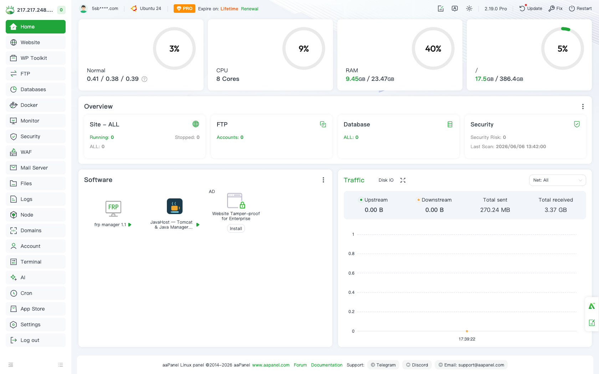
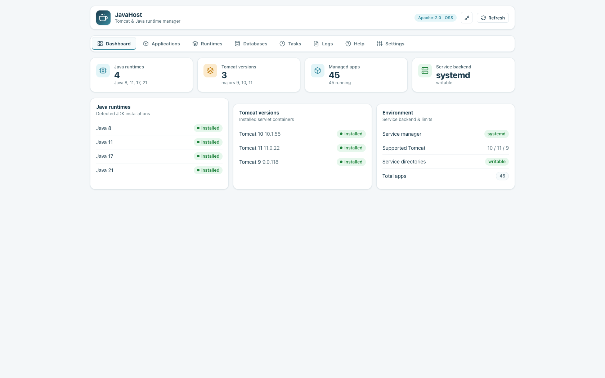
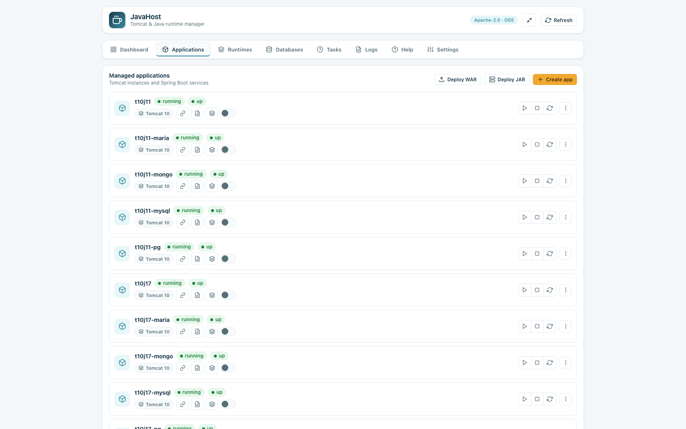
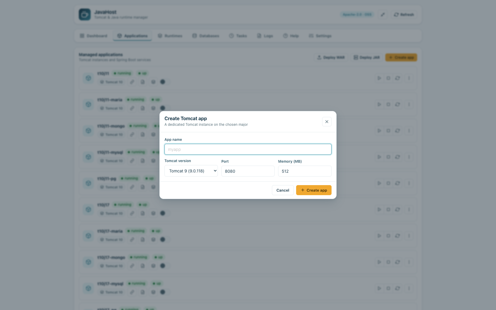
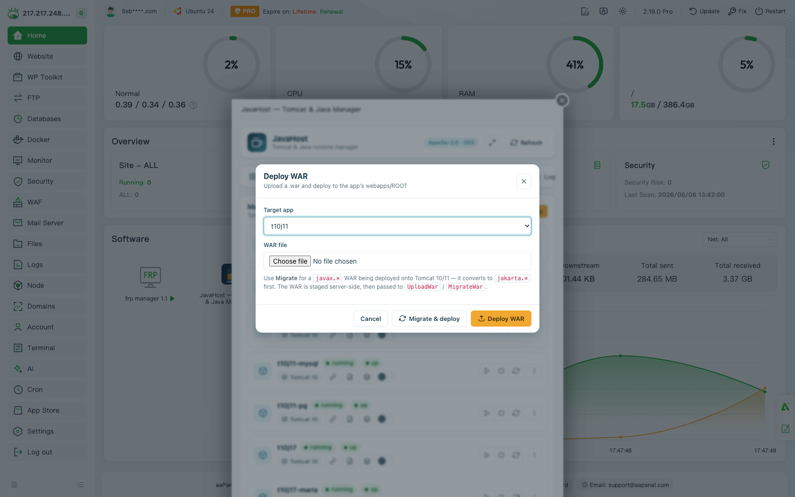
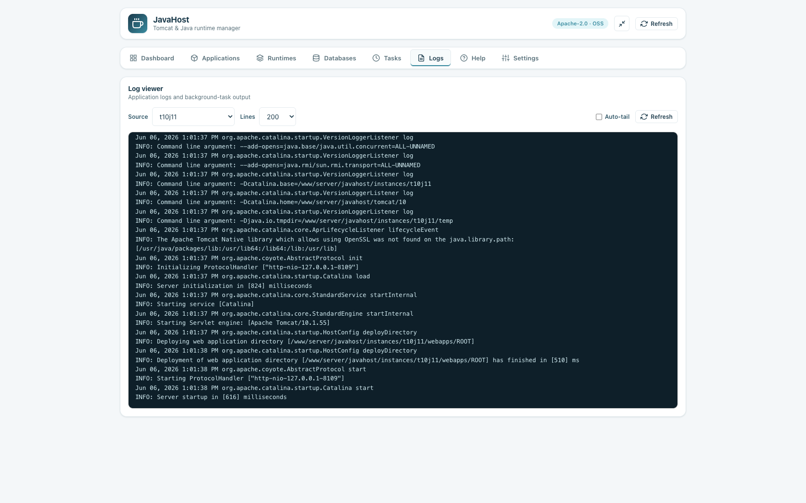
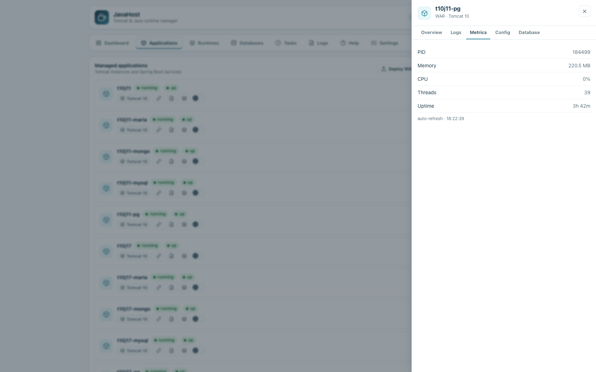
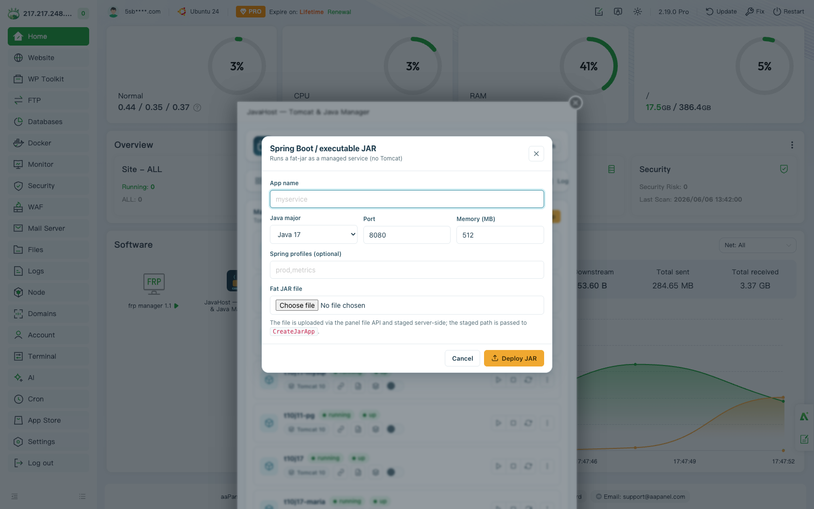
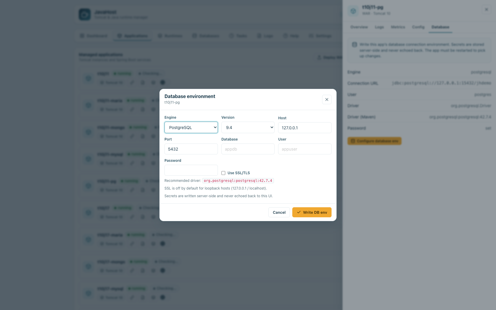
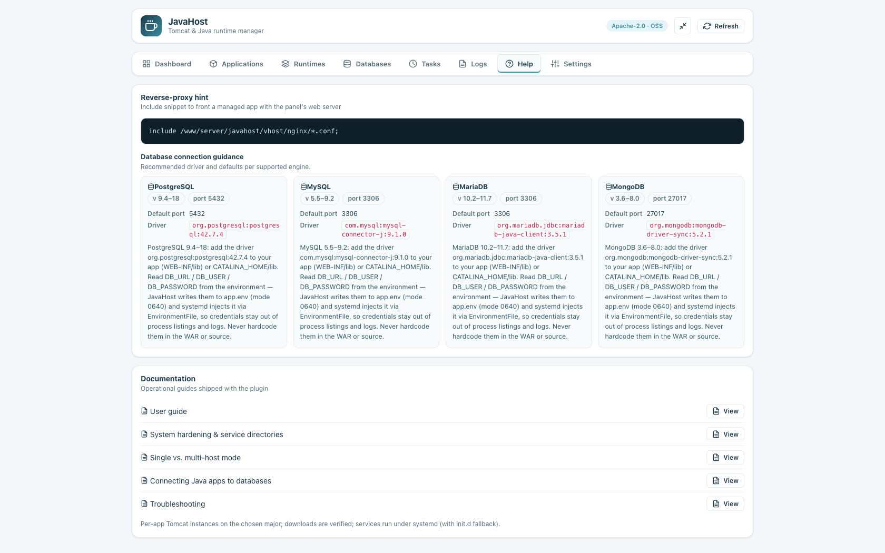

# JavaHost — Administrator user guide

A task-oriented walkthrough of the JavaHost plugin UI. Each step notes the
server-side endpoint it triggers, so you know exactly what the panel is doing on
your behalf. JavaHost is **host-local**: everything it manages runs on the same
server the plugin is installed on (see
[Single-host vs. multi-server](single-vs-multi-mode.md)).

> Screenshots referenced below live in [`images/`](images/) — that directory is a
> placeholder; the maintainer drops the PNGs in and they render in place.

---

## 1. Install and open the plugin

JavaHost ships as a single importable ZIP.

1. In aaPanel go to **App Store → Third-party**.
2. Click **Import plugin** and select `javahost.zip`
   (download it from the project Releases page).
3. After import, open **JavaHost** from the app list.



The panel loads `index.html` and immediately calls `GetStatus` to populate the
**Dashboard**. The UI talks to the backend over the panel convention
`POST /plugin?action=a&name=javahost&s=<Method>`; responses use the standard
`{status, msg}` envelope.

### The Dashboard



The Dashboard (the default tab) shows four stat tiles and three cards, all from a
single `GetStatus` call:

- **Java runtimes** — JDK majors detected on the host (8 / 11 / 17 / 21).
- **Tomcat versions** — installed servlet-container majors and their patch level.
- **Managed apps** — total apps and how many are running.
- **Service backend** — `systemd` (preferred) or `init.d` fallback, plus whether
  the service directories are writable or **locked**.

The three cards break this out into **Java runtimes**, **Tomcat versions**, and
an **Environment** card (service manager, supported Tomcat majors, service-dir
state, total apps). Use the **Refresh** button in the top bar to re-poll
`GetStatus` at any time.

#### Hardening banner


If `GetStatus` reports `service_dirs_locked: true`, a red banner appears warning
that **System hardening is active** and JavaHost cannot register services. It
includes an **Allow services** button — see [section 7](#7-system-hardening).
On a normally-hardened host with default settings this banner stays hidden,
because JavaHost manages hardening transparently.

---

## 2. Runtimes — install Java and Tomcat

Open the **Runtimes** tab. It has two cards, both driven by the latest
`GetStatus` data.


### Install Java

Java majors **8, 11, 17, 21** are listed. Detected JDKs show an *installed*
badge; missing ones show an **Install** button.

- Clicking **Install** calls `InstallJava` with the major.
- The server queries the Adoptium API for the latest Temurin build, verifies it
  (**SHA-256**, refusing unverified artifacts), and extracts it to
  `/www/server/javahost/runtimes/jdk-<major>`.
- Each runtime keeps its own `JAVA_HOME`; it never mutates system `alternatives`,
  so apps can run on different JDKs side by side
  (see [Java runtime](java-runtime.md)).

### Install / update / uninstall Tomcat

Supported majors are **9** (legacy, `javax.*`), **10.1**, and **11** (both
`jakarta.*`). Each row shows the patch, namespace, and **minimum Java**.

- **Install** → `InstallTomcat`; **Update** → `UpdateTomcat` (resolves and stages
  the latest patch, atomic with rollback); **Uninstall** → `UninstallTomcat`.
- Downloads are **SHA-512 + OpenPGP verified** before use.

**Java floors are enforced** ([Tomcat 10.1](tomcat-10.md),
[Tomcat 11](tomcat-11.md)):

| Tomcat line | Minimum Java | Namespace |
|-------------|--------------|-----------|
| 9           | 8+           | `javax`   |
| 10.1        | **11+**      | `jakarta` |
| 11          | **17+**      | `jakarta` |

If no qualifying JDK is installed when you install Tomcat, the server
auto-installs a Temurin build that meets the floor (17 for floors ≤ 17, else 21).

---

## 3. Applications — create, deploy WAR, manage

Open the **Applications** tab. Empty state offers shortcuts to create an app or
deploy a Spring Boot JAR.



### Create a Tomcat app

Click **Create app**.



Fill in:

- **App name** — validated server-side as an identifier.
- **Tomcat version** — chosen from installed majors.
- **Port** (default `8080`) and **Memory MB** (default `512`).

Submitting calls `CreateApp`, which provisions a dedicated `CATALINA_BASE` on the
chosen major, pins its `JAVA_HOME`, allocates the port (auto-resolving a free one
on the local host), and registers a `javahost-<app>` service.

### Deploy a WAR

Click **Deploy WAR** (toolbar) or use a row's action menu.



1. Pick the target app and choose a `.war` file.
2. The file is uploaded via the panel file API and **staged** server-side under
   `/tmp`.
3. Choose **Deploy WAR** → `UploadWar`, or **Migrate & deploy** → `MigrateWar`.

Extraction is **zip-slip-safe** into the app's `webapps/ROOT`. For a `javax.*`
WAR being deployed onto Tomcat 10/11, use **Migrate & deploy**: it runs the
Apache `javax`→`jakarta` migration tool first, then deploys the converted
artifact. A plain deploy onto a `jakarta` line still surfaces a **namespace
warning** if the WAR looks like `javax.*`.

### Lifecycle, repair, delete

Each row has a quick **Restart** button and a **More actions** menu:

- **Start / Stop / Restart** → `AppAction` with the corresponding action.
- **Repair** → `RepairApp` (re-renders the service/config; also the recovery step
  after authorizing hardening).
- **Delete app** → `DeleteApp` (removes the instance and its files; confirms
  first).

### Logs, health, metrics

- **View logs** opens a monospace viewer (`GetLogs`) with a **lines** selector
  (50/200/500/1000) and a **Refresh** button. Log bytes are never interpreted as
  HTML.

  

- **Check health** updates the row's health pill via `GetHealth` (`up`/`down`,
  port, HTTP code). Health is auto-checked for every app on each refresh.
- **Metrics** opens a panel (`GetMetrics`) reading PID, RSS memory, thread count,
  and uptime from `/proc`. Use its **Refresh** to re-poll.

  

---

## 4. Spring Boot / executable JARs

JavaHost can run a fat-jar directly, with no Tomcat. From **Applications** click
**Deploy JAR**.



Provide:

- **App name**, **Java major** (17 / 21 / 11 / 8), **Port**, **Memory MB**.
- **Spring profiles** (optional, e.g. `prod,metrics`).
- The **fat JAR** file.

The JAR is staged via the panel file API, then `CreateJarApp` registers it as a
managed service. Spring Boot is auto-detected; the profiles you enter are passed
through to the running service.

---

## 5. Databases — connect a Java app to a database

JavaHost does **not** manage database servers — it helps an app *connect* to one
safely (full reference: [Connecting Java apps to databases](databases-java-apps.md)).

Open the **Databases** tab.


The top card is a read-only **support matrix** (`GetDbSupport`): engine, default
port, version range, recommended driver, and whether the engine is detected
locally.

| Engine | Versions | Default port | Driver coordinates |
|--------|----------|--------------|--------------------|
| PostgreSQL | 9.4 – 18 | 5432 | `org.postgresql:postgresql` |
| MySQL | 5.5 – 9.x | 3306 | `com.mysql:mysql-connector-j` |
| MariaDB | 10.2 – 11.x | 3306 | `org.mariadb.jdbc:mariadb-java-client` |
| MongoDB | 3.6 – 8.0 | 27017 | `org.mongodb:mongodb-driver-sync` |

### Write a per-app DB environment

Pick an app from the **Per-app database environment** picker (or use a row's
**Database env** action). This opens the DB modal.



Choose the **engine** (the version list and default **port** auto-fill, and the
recommended **driver** is shown), then enter **host**, **database**, **user**, and
**password**. Clicking **Write DB env** calls `SetDbEnv`, which writes
`CATALINA_BASE/bin/app.env` (mode `0640`) — loaded by the service via
`EnvironmentFile`. Your app reads:

```
DB_URL           # connection URL/URI, no password embedded
DB_USER
DB_PASSWORD      # supplied to the driver at runtime
DB_DRIVER        # driver class
DB_DRIVER_MAVEN  # coordinates for your build / CATALINA_HOME/lib
```

**Secrets are written server-side and never echoed back to the UI**, and never
appear in process listings, the connection URL, or logs. Never hardcode
credentials in the WAR.

---

## 6. Reverse proxy

Open the **Help** tab. The **Reverse-proxy hint** card (`GetProxyHint`) shows an
Nginx vhost **include snippet** that fronts a managed app via the panel's web
server.



The generated proxy targets a **local** upstream (e.g. `127.0.0.1:<port>`);
JavaHost owns only its own vhost and never edits other plugins' configs. Paste the
include into the site's Nginx config to publish the app on a domain.

JavaHost can also create the managed site for you with **`SetSite{app, domain?}`**
(remove with **`RemoveSite{app}`**). With no `domain`, it uses the
`<app>.<suffix>` convention, where the suffix is the plugin config key
**`site_suffix`** (in `/www/server/javahost/config.json`). `site_suffix` is
**empty by default** — so unless you set one, you supply an explicit domain and no
FQDN is ever guessed.

### Per-site HTTPS (Let's Encrypt)

Once a reverse-proxy site exists, turn on TLS for it with
**`SetSiteSSL{app, enable, email?}`**:

- **`enable` truthy** — issues a Let's Encrypt certificate and rewrites the vhost
  to terminate TLS on `:443`; the `:80` server keeps serving the ACME challenge
  and 301-redirects to https. Issuance tries aaPanel's **native ACME first** and
  falls back to **certbot `--webroot`** if that doesn't place a live cert. `email`
  is optional (used for ACME registration). The domain is the site's stored
  domain, an explicit `domain`, or the `site_suffix` convention — never a guessed
  FQDN.
- **`enable` falsy** — reverts the site to plain HTTP. The **certificate is kept
  on disk**, so re-enabling is instant.

A certbot **deploy hook**
(`/etc/letsencrypt/renewal-hooks/deploy/javahost-nginx.sh`) is installed so nginx
reloads automatically after each renewal, and the SSL on/off state is recorded per
instance at `<base>/bin/site.ssl`. With SSL on, the app sees `X-Forwarded-Proto:
https`, so its request scheme reads `https` end-to-end.

---

## 7. System hardening

aaPanel **System Hardening** locks `/etc/systemd/system` and `/etc/init.d` with
the immutable bit to block persistence attacks. JavaHost operates safely under it
(full detail: [System Hardening](system-hardening.md)).

What to expect:

- **By default** (`manage_hardening: true`) JavaHost briefly lifts the immutable
  bit on a service directory only long enough to write its own `javahost-<app>`
  unit, then re-applies it — every lift and restore is logged. Tomcat/JDK
  install, WAR/JAR deploy, ports, and config rendering all work regardless.
- The Dashboard banner only appears when JavaHost **genuinely cannot** manage
  services (hardening on **and** `manage_hardening: false`, or `chattr` missing).

### The Allow services button

When the banner shows, click **Allow services** (`AllowServices`). This
**registers** JavaHost in aaPanel's syssafe process allowlist — append-only,
backed up, reversible. It never bypasses anti-persistence controls. If a global
LD_PRELOAD exec filter (bt_security / usranalyse) is also active, JavaHost detects
it and stops with a clear error rather than circumventing it; authorize JavaHost
in **Security → bt_security**, then **Repair** the app.

---

## 8. Troubleshooting & deployment scope

- Most failures are **fail-closed** — JavaHost refuses rather than do something
  unsafe. Errors surface in the `{status, msg}` envelope and as toasts.
  See [Troubleshooting](troubleshooting.md) for download/verification, service,
  hardening, and deploy errors.
- JavaHost is **host-local**. For multi-node Java workloads, install JavaHost on
  **each** host; installations are independent with no shared state or
  cross-node port registry. See
  [Single-host vs. multi-server](single-vs-multi-mode.md).
