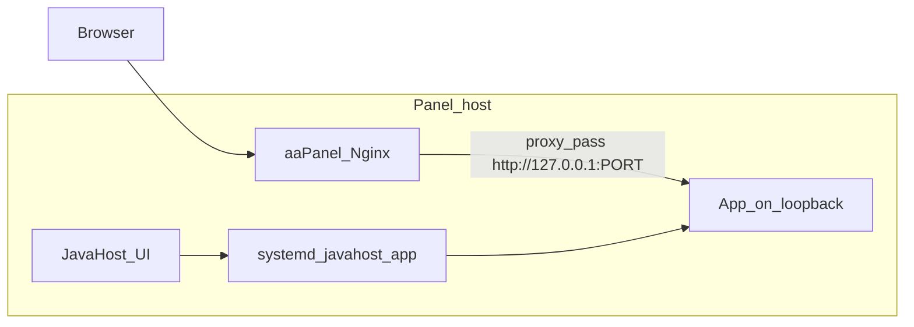
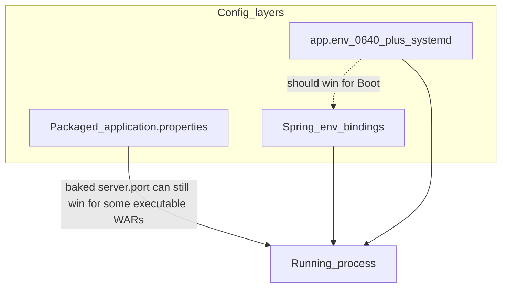
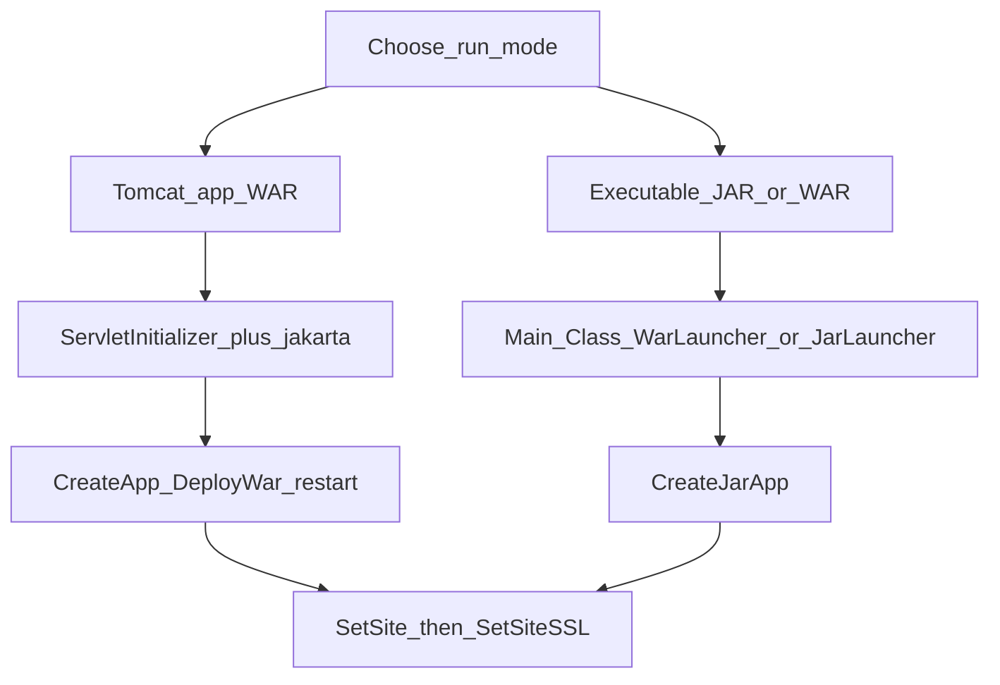
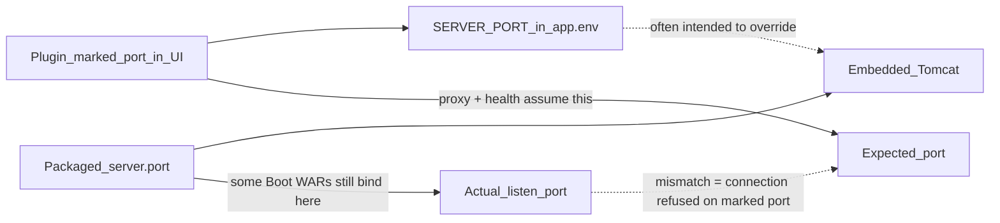
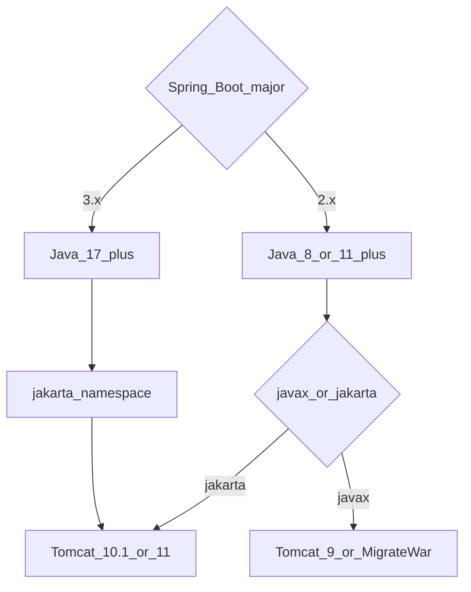
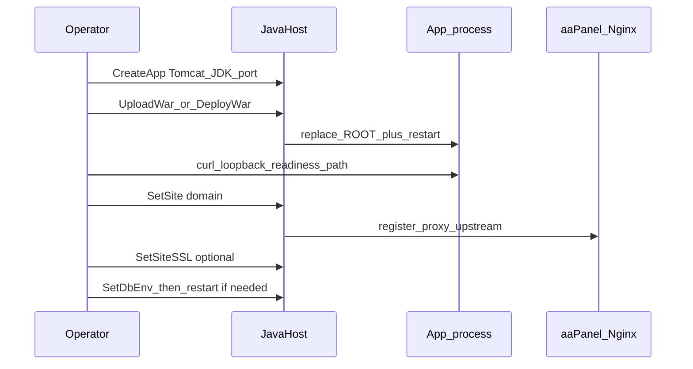

# Packaging WARs for JavaHost — developer and deployment guide

How to **build** a WAR (or Spring Boot executable WAR/JAR) that JavaHost can
run, and how to **deploy and verify** it on an aaPanel host. Written for two
audiences; skim the path that matches your role.

| Role | Start here |
|------|------------|
| **App developer** | [Pick a run mode](#3-pick-a-run-mode) → [Package for Tomcat](#4-package-a-war-for-tomcat) or [executable](#5-package-an-executable-jarwar) → [Before you build](#12-quick-reference-checklists) |
| **Panel operator** | [How JavaHost runs apps](#2-how-javahost-runs-your-app) → [Operator deploy checklist](#7-operator-deploy-checklist) → [Verify honestly](#10-verify-success-honestly) → [Troubleshooting](#11-troubleshooting) |

Companion docs: [User guide](../plugin/javahost/docs/user-guide.md) ·
[Databases / `app.env`](../plugin/javahost/docs/databases-java-apps.md) ·
[Troubleshooting](../plugin/javahost/docs/troubleshooting.md).

> Placeholders only below (`app.example.com`, `127.0.0.1`). Never put real panel
> hostnames, IPs, or credentials in WARs, tickets, or screenshots.

---

## 1. Who this is for

**Developers** own the artifact: packaging type, Jakarta vs javax, what listens
where, which URL proves “up”, and how secrets are injected.

**Operators** own the host: Tomcat/JDK line, Create app → Deploy → reverse proxy
→ SSL, `app.env`, and reading logs when the green toast lies.

Both need the same mental model: **JavaHost does not rewrite your WAR**. What
you bake in is what runs (plus env from `bin/app.env`).

---

## 2. How JavaHost runs your app



Key facts:

- The HTTP connector binds to **`127.0.0.1:<port>`** (not the public IP).
  Clients reach the app through an aaPanel reverse-proxy site (`SetSite`), not
  by opening the raw port on the WAN.
- Tomcat instances use **`autoDeploy="false"`**. Uploading into `webapps/ROOT`
  alone does not reload the app — JavaHost **restarts** the service after a
  successful deploy.
- Deploy replaces `webapps/ROOT` **atomically** (stage → swap), then restarts.
- Config layers (highest practical override for ops): systemd / `app.env` →
  Spring env bindings → packaged `application.properties` inside the WAR.
  JavaHost does **not** currently rewrite properties inside the archive.



---

## 3. Pick a run mode



| Mode | Create in UI | Artifact | Best when |
|------|--------------|----------|-----------|
| **Tomcat WAR** (recommended for most web apps) | Create **Tomcat** app → **Deploy WAR** | `.war` extracted to `webapps/ROOT` | Classic servlets/JSPs, or Spring Boot with `SpringBootServletInitializer` |
| **Executable JAR/WAR** | Create **JAR** app | `java -jar` with `Main-Class` | Fat JAR / Boot executable; you accept embedded Tomcat and port rules below |

**Insight:** Many Spring Boot projects produce an *executable WAR* (Manifest
`Main-Class: …WarLauncher` **and** a `ServletInitializer`). You can run that
same file either way. Prefer **Tomcat mode** on JavaHost unless you have a
reason to keep embedded Tomcat.

---

## 4. Package a WAR for Tomcat

### 4.1 Required shape

- Maven/Gradle **`packaging = war`** (not a plain JAR renamed `.war`).
- For Spring Boot: extend **`SpringBootServletInitializer`** (often a
  `ServletInitializer` class) so the external container starts the context.
- Layout JavaHost expects after extract: `WEB-INF/…` under `webapps/ROOT`
  (context path `/` unless you change the Tomcat context).
- **Boot 3.x** needs **Java 17+** and the **jakarta.*** namespace → use
  **Tomcat 10.1 or 11**, not Tomcat 9.

### 4.2 Do / don’t

**Do**

- Keep secrets out of the WAR. Use JavaHost **Databases** → `SetDbEnv` /
  `app.env`, or Spring’s env overrides (`SPRING_DATASOURCE_URL`, etc.).
- Ship a **readiness URL** you can curl after deploy:
  `/actuator/health`, `/swagger-ui.html`, `/v3/api-docs`, or a tiny `/healthz`.
- Document any **host paths** the app needs (key stores, GPG dirs, upload
  roots). Paths like `/app/gpg-keys` assume Docker; on a panel host they must
  exist under a real directory the `www` user can read.
- Align Redis/DB hosts with what the **panel host** can reach (not a laptop’s
  `192.168.x.x` from a different network).

**Don’t**

- Rely on **`server.port`** under external Tomcat — the connector port comes
  from JavaHost’s `server.xml`, not from `application.properties`.
- Treat **`/` returning 404** as a failed deploy. Many APIs have no welcome
  page; swagger or a health endpoint is the real signal.
- Bundle production passwords in `application.properties` “just for testing”
  and forget to strip them before upload.

### 4.3 Minimal Spring Boot WAR sketch

```xml
<!-- pom.xml -->
<packaging>war</packaging>
<dependencies>
  <dependency>
    <groupId>org.springframework.boot</groupId>
    <artifactId>spring-boot-starter-web</artifactId>
  </dependency>
  <dependency>
    <groupId>org.springframework.boot</groupId>
    <artifactId>spring-boot-starter-tomcat</artifactId>
    <scope>provided</scope>
  </dependency>
</dependencies>
```

```java
public class ServletInitializer extends SpringBootServletInitializer {
  @Override
  protected SpringApplicationBuilder configure(SpringApplicationBuilder app) {
    return app.sources(MyApplication.class);
  }
}
```

Optional but recommended:

```yaml
# application.yml — no passwords; port ignored on external Tomcat
management.endpoints.web.exposure.include: health
management.endpoint.health.show-details: never
```

---

## 5. Package an executable JAR/WAR

### 5.1 Manifest

- `Main-Class` must be a Boot launcher (`JarLauncher` or `WarLauncher`) or your
  own main. JavaHost’s JAR path requires an executable Manifest.

### 5.2 Port ownership (important)



JavaHost writes `SERVER_PORT=<marked>` into `bin/app.env` and the systemd unit.
**Some Spring Boot executable WARs still bind the packaged `server.port`**
(e.g. `9090`) and ignore the env for listen purposes. Then:

- UI / reverse proxy aim at the **marked** port → **connection refused**.
- `ss` / logs show Tomcat on the **packaged** port.

**Workarounds (today):**

1. Prefer **Tomcat WAR mode** (external connector; packaged `server.port` is
   irrelevant), or
2. Remove / default `server.port` in the artifact and rely on `SERVER_PORT`, or
3. Rebuild so the app honors env / command-line `--server.port=` (operators may
   need a unit override until the plugin always passes `-Dserver.port=`).

**Insight:** Service status **`active` is not proof of the marked port**. Always
confirm the listen address in logs (`Tomcat started on port …`) or with `ss`.

### 5.3 Logs

Executable apps often log to **journald** (`journalctl -u javahost-<app>`) while
`instances/<app>/logs/` stays empty. Use the plugin **Logs** / **Tasks** views
and journal on the host when the file viewer is blank.

---

## 6. Tomcat / Java / namespace matrix



| App stack | Namespace | Tomcat | Min Java |
|-----------|-----------|--------|----------|
| Spring Boot **3.x** | jakarta | **10.1** or **11** | **17** |
| Spring Boot **2.x** (javax) | javax | **9** (or migrate) | 8/11+ |
| Legacy `javax.servlet` WAR | javax | **9** or **Migrate and deploy** | per line |
| Jakarta EE 9+ WAR | jakarta | **10.1** / **11** | 11 / 17 |

### Namespace detection caveat

JavaHost’s `detect_namespace` looks for `javax/servlet` / `jakarta/servlet`
paths and `web.xml` / TLD text. **Modern Boot WARs often return `None`**: they
ship Jakarta APIs only inside `WEB-INF/lib/*.jar` and may omit `web.xml`. A
missing warning does **not** mean “any Tomcat is fine” — pick the line from the
matrix above (Boot 3 → Tomcat 10.1/11).

Use **Migrate and deploy** only for true `javax.*` artifacts aimed at Tomcat
10/11.

---

## 7. Operator deploy checklist



1. **Runtimes** — Install the Tomcat line and JDK from the matrix.
2. **Create app** — Tomcat app, pin Java, note the allocated loopback port.
3. **Deploy WAR** — Prefer server-side path / staged upload; large browser
   uploads can fail with opaque `Failed to fetch` (panel session/size limits).
4. **Wait for start** — Logs should show something like
   `Started ServletInitializer` / `Started …Application` (Boot can take 30–60s).
5. **Loopback check** — From the host:
   `curl -sS -o /dev/null -w '%{http_code}\n' http://127.0.0.1:<port>/<ready>`
6. **Publish** — Settings: aaPanel **API key** if required → **SetSite** with a
   real domain → confirm Website → Reverse Proxy shows
   `http://127.0.0.1:<port>`.
7. **SSL** — `SetSiteSSL` only after HTTP proxy works (ACME needs a reachable
   site).
8. **Database** — Databases tab → `SetDbEnv` → restart app → re-check readiness.

Do **not** delete unrelated production apps while testing; use disposable names
(`jhprobe…`).

---

## 8. Secrets and config

- **Never** hardcode DB/Redis passwords in the WAR. See
  [Connecting Java apps to databases](../plugin/javahost/docs/databases-java-apps.md).
- Prefer Spring env: `SPRING_DATASOURCE_URL`, `SPRING_DATASOURCE_USERNAME`,
  `SPRING_DATASOURCE_PASSWORD` (or map JavaHost’s `DB_*` in your code).
- Redis, SMTP, and third-party URLs must be reachable **from the panel host**.
- File/key material: document absolute paths and permissions for user `www`.

---

## 9. Publish path (proxy and SSL)

- Reverse proxy **must** target the port the process **actually** listens on
  (see [§5.2](#52-port-ownership-important)).
- Configure **Settings → aaPanel API** (interface key / panel port) so
  `SetSite` can register a real proxy upstream — a site row without an upstream
  is not success.
- SSL is per site after HTTP works; prefer aaPanel-owned site SSL when the site
  was created through the panel APIs.

---

## 10. Verify success honestly

| Signal | Means | Not enough alone |
|--------|--------|------------------|
| Toast “WAR deployed” / `restarted: true` | Files swapped + service restart requested | App context may still be starting or failing |
| systemd `active` | Process supervisor happy | Wrong port / crash-loop after start |
| `Started …` in logs | Spring/Tomcat context up | Business deps (DB) may still be broken on first request |
| HTTP 200 on readiness URL | App answers | — |
| `/` → 404 | Often **normal** for API-only apps | Do not treat as deploy failure |
| Swagger / OpenAPI 200 | Useful for API WARs | Root may still 404 |
| Proxy Host header → same body as loopback | Publish path OK | — |

**False greens to watch:** site created but no upstream; SSL toast while
`ssl=false` on older builds; JAR `active` while listening on packaged port ≠
marked port.

---

## 11. Troubleshooting

- **`/` is 404, swagger works** — App has no root mapping. Use the documented
  API or swagger URL for health checks and proxy smoke tests.
- **Everything 404, but “Started” in logs** — Wrong context path, filters, or
  security; confirm mappings (`/v3/api-docs`, controller prefixes). Not a
  zip-slip failure if restart completed.
- **Connection refused on marked port** — Likely executable mode bound
  packaged `server.port`. Check logs for `Tomcat started on port …`; switch to
  Tomcat WAR mode or fix port packaging.
- **`[GPG …] directory does not exist: /app/…`** — App expects a container path.
  Create the host directory or reconfigure the path; JavaHost does not invent
  Docker volumes.
- **DB / Redis connection errors** — Fix `app.env` and network; redeploy alone
  will not fix unreachable `192.168.x.x` baked into properties.
- **Namespace warning missing on Boot 3 WAR** — Expected limitation; still use
  Tomcat 10.1/11 + Java 17.
- **Browser upload fails (`Failed to fetch`)** — Use a smaller artifact, panel
  file manager to stage under `/tmp`, then **Deploy WAR** with the server path,
  or `DeployWar` from an ops script.
- **Slow first start** — Boot + JPA warmup can exceed 30s; wait and re-curl
  before declaring failure.

---

## 12. Quick reference checklists

### Before you build

- [ ] Packaging is `war` (Tomcat mode) or executable Manifest (JAR mode)
- [ ] Boot 3 → Java 17 + jakarta + Tomcat 10.1/11
- [ ] `ServletInitializer` present for external Tomcat
- [ ] No production secrets in `application.properties`
- [ ] Readiness path documented for operators
- [ ] Host paths for keys/files documented (no blind `/app/...`)

### Before you upload

- [ ] Correct Tomcat line + JDK installed on the panel
- [ ] Disposable app name for tests
- [ ] DB/Redis reachable from the host (or deferred until `SetDbEnv`)
- [ ] Know the readiness URL (not only `/`)

### After deploy

- [ ] Logs show Started / no fatal stack on startup
- [ ] `curl` readiness on `127.0.0.1:<actual-port>`
- [ ] Listen port matches UI (especially JAR mode)
- [ ] `SetSite` proxy upstream correct
- [ ] SSL only after HTTP works
- [ ] `SetDbEnv` + restart if the app needs a database

---

## 13. What JavaHost does and does not do

**Does**

- Install Tomcat/JDK, create per-app `CATALINA_BASE`, systemd units
- Zip-slip-safe WAR extract, atomic ROOT replace, restart on deploy
- Optional javax→jakarta **Migrate and deploy**
- Secret-safe `app.env`, aaPanel reverse proxy + SSL helpers
- Surface logs/tasks in the UI

**Does not (today)**

- Rewrite packaged `application.properties`
- Always force embedded Boot to the marked port via `--server.port`
- Auto-detect every controller route or invent a root homepage
- Mount Docker-style volumes for `/app/...`
- Guarantee `detect_namespace` on Boot fat WARs without `web.xml`

---

## See also

- [User guide — Deploy a WAR](../plugin/javahost/docs/user-guide.md)
- [Databases — secret-safe `app.env`](../plugin/javahost/docs/databases-java-apps.md)
- [Troubleshooting](../plugin/javahost/docs/troubleshooting.md)
- [Testing runbook](testing.md)
