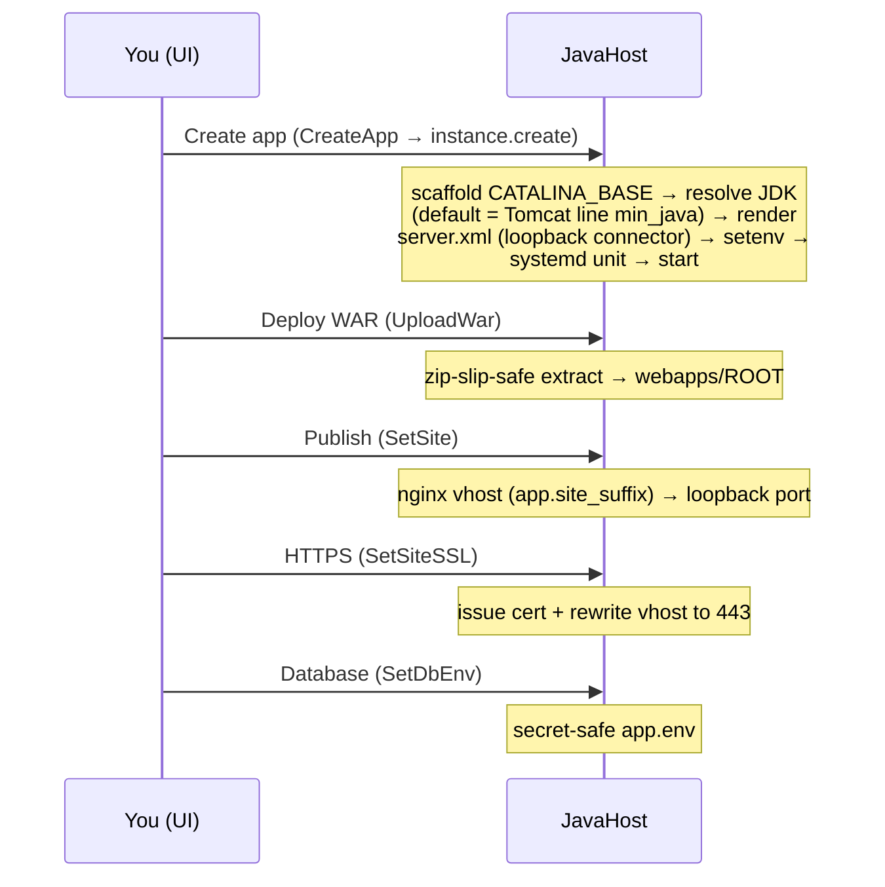
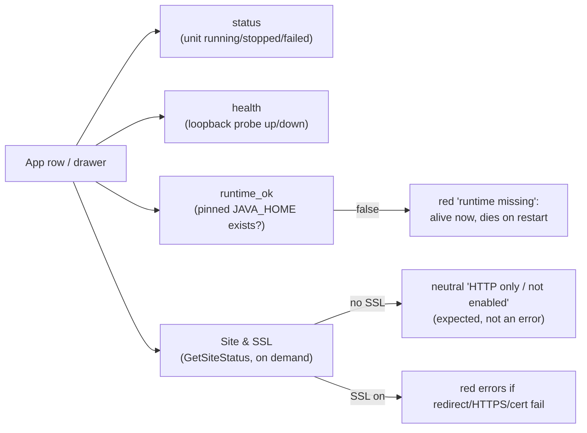
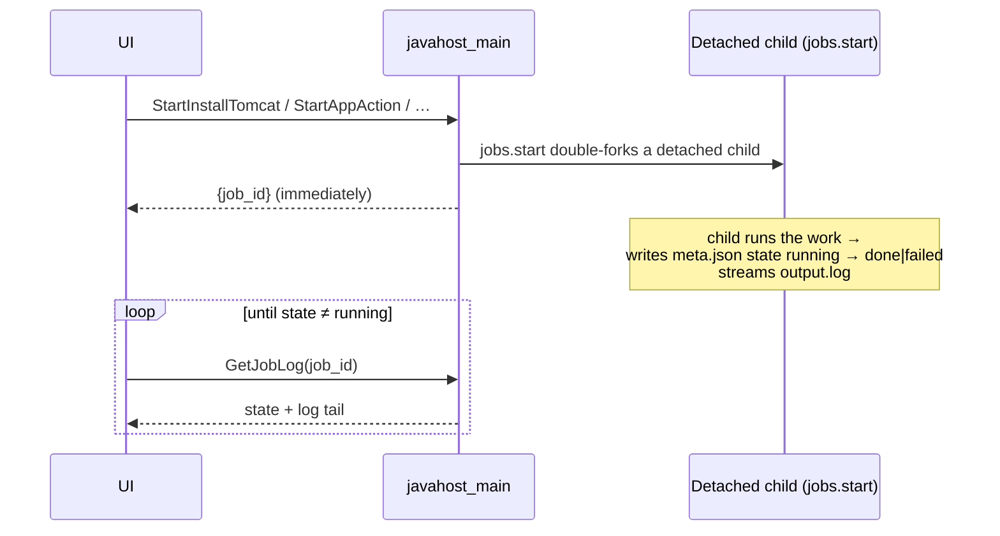

# JavaHost — Administrator user guide

A task-oriented walkthrough of the JavaHost plugin UI. Each step notes the
server-side endpoint it triggers, so you know exactly what the panel is doing on
your behalf. JavaHost is **host-local**: everything it manages runs on the same
server the plugin is installed on (see
[Single-host vs. multi-server](single-vs-multi-mode.md)).

> Screenshots referenced below live in [`images/`](images/); see that directory's
> [shot-list](images/README.md) for exactly what each one captures. Most are best
> taken in the plugin's **Fullscreen** mode (below).

### Top tabs and Fullscreen

The plugin's top bar has eight tabs — **Dashboard · Applications · Runtimes ·
Databases · Tasks · Logs · Help · Settings** — implemented as an accessible
WAI-ARIA Tabs pattern (arrow/Home/End navigation). The header also has a
**Fullscreen** toggle that pops the plugin out of aaPanel's cramped modal to fill
the whole viewport (own CSS only, no panel patching); **Esc** exits. Use it
whenever you work with the Applications drawer, Tasks, or Logs.


---

## 1. Install and open the plugin

JavaHost ships as a single importable ZIP.

1. In aaPanel go to **App Store → Third-party**.
2. Click **Import plugin** and select `javahost.zip`
   (download it from the project Releases page).
3. After import, open **JavaHost** from the app list.


The panel loads `index.html` and immediately calls `GetStatus` to populate the
**Dashboard**. The UI talks to the backend over the panel convention
`POST /plugin?action=a&name=javahost&s=<Method>`; responses use the standard
`{status, msg}` envelope.

### The Dashboard


The Dashboard (the default tab) shows four stat tiles and three cards, all from a
single `GetStatus` call:

- **Java runtimes** — JDK majors detected on the host (8 / 11 / 17 / 21).
- **Tomcat versions** — installed servlet-container majors and their patch level.
- **Managed apps** — total apps and how many are running.
- **Service backend** — `systemd` (preferred) or `init.d` fallback, plus whether
  the service directories are writable or **locked**.

The three cards break this out into **Java runtimes**, **Tomcat versions**, and
an **Environment** card (service manager, supported Tomcat majors, service-dir
state, total apps). Use the **Refresh** button in the top bar to re-poll
`GetStatus` at any time.

#### Hardening banner


If `GetStatus` reports `service_dirs_locked: true`, a red banner appears warning
that **System hardening is active** and JavaHost cannot register services. It
includes an **Allow services** button — see [section 7](#7-system-hardening).
On a normally-hardened host with default settings this banner stays hidden,
because JavaHost manages hardening transparently.

---

## 2. Runtimes — install Java and Tomcat

Open the **Runtimes** tab. It has two cards, both driven by the latest
`GetStatus` data.


### Install / reinstall / uninstall Java

Java majors **8, 11, 17, 21** are listed. Detected JDKs show an *installed* badge;
each row has **Install**, **Reinstall**, and **Uninstall** actions.

- **Install** → `StartInstallJava` (async; sync `InstallJava` also exists). The
  server queries the Adoptium API for the latest Temurin build, verifies it
  (**SHA-256**, refusing unverified artifacts), and extracts it to
  `/www/server/javahost/runtimes/jdk-<major>`. Watch it finish in
  [Tasks](#9-tasks--logs).
- **Reinstall** → `StartReinstallJava` (async) reinstalls the same major.
- **Uninstall** → `StartUninstallJava` (async; sync `UninstallJava` too). It is
  **blocked while the JDK is in use** by deployed apps — JavaHost shows a **"Java N
  is in use"** dialog listing the dependents (from `GetJavaUsage`). Choosing
  **Force** overrides the block and **stops** those dependent apps so they go
  cleanly DOWN.

  

JavaHost is **self-contained**: it manages only its own JDKs under `runtimes/`
(plus distro JDKs in `/usr/lib/jvm`) and no longer reuses aaPanel's
`/usr/local/btjdk`. Each runtime keeps its own `JAVA_HOME`; it never mutates
system `alternatives`, so apps can run on different JDKs side by side (see
[Java runtime](java-runtime.md)).

### Install / update / uninstall Tomcat


Supported majors are **9** (legacy, `javax.*`), **10.1**, and **11** (both
`jakarta.*`). Each row shows the patch, namespace, and **minimum Java**.

- **Install** → `InstallTomcat` / `StartInstallTomcat` (async); **Update** →
  `UpdateTomcat` (resolves and stages the latest patch, atomic with rollback);
  **Uninstall** → `StartUninstallTomcat` (async) / `UninstallTomcat`.
- Downloads are **SHA-512 + OpenPGP verified** before use. Watch installs finish
  in [Tasks](#9-tasks--logs).

**Java floors are enforced** ([Tomcat 10.1](tomcat-10.md),
[Tomcat 11](tomcat-11.md)):

| Tomcat line | Minimum Java | Namespace |
|-------------|--------------|-----------|
| 9           | 8+           | `javax`   |
| 10.1        | **11+**      | `jakarta` |
| 11          | **17+**      | `jakarta` |

If no qualifying JDK is installed when you install Tomcat, the server
auto-installs a Temurin build that meets the floor (17 for floors ≤ 17, else 21).

---

## 3. Applications — create, deploy WAR, manage

Open the **Applications** tab. It is a **rich list** with a slide-over **detail
drawer**. The empty state offers shortcuts to create an app or deploy a JAR.


Each row shows: the app **type** (WAR / Spring Boot JAR / Tomcat), a **runtime
chip** (e.g. Tomcat 11 · Java 17), a **status badge**, a **health pill** + port,
and an inline **Start / Stop / Restart** control. Two states are flagged
prominently:

- A red **"runtime missing"** badge when the app's pinned JDK has been removed —
  the app may still be running on its live JVM but **won't survive a restart**
  (driven by `runtime_ok`; see [Java runtime](java-runtime.md#runtime_ok-and-the-runtime-missing-badge)).
- An **Open ↗** link to the app's reverse-proxy domain (with copy-URL / copy-port
  buttons) and a **per-site HTTPS toggle** — both covered in
  [section 6](#6-reverse-proxy--per-site-https).

The Start/Stop/Restart actions are **async**: they call `StartAppAction{app,
action}`, which runs the lifecycle change as a background job so a slow systemd
transition can't time out the panel (watch it in [Tasks](#9-tasks--logs)). The
list and health auto-refresh (~5s) while the section is visible.

#### The deploy lifecycle

End to end, an app goes from creation to a published HTTPS endpoint with a
database in five steps — each one a distinct endpoint:



### Create a Tomcat app

Click **Create app**.


Fill in:

- **App name** — validated server-side as an identifier.
- **Tomcat version** — chosen from installed majors.
- **Java (JDK pin)** — optional; pin which installed JDK the app runs on. Left
  unset, JavaHost uses the Tomcat line's baseline (9→Java 8, 10.1→11, 11→17).
- **Port** (default `8080`) and **Memory MB** (default `512`).

Submitting calls `CreateApp` (which accepts the `java` pin), provisions a
dedicated `CATALINA_BASE` on the chosen major, pins its `JAVA_HOME`, allocates the
port (auto-resolving a free one on the local host), and registers a
`javahost-<app>` service. The Tomcat HTTP connector binds **`127.0.0.1`** by
design — see [section 6](#6-reverse-proxy--per-site-https).

### The detail drawer

Clicking a row opens a focus-trapped, Esc-closable **drawer** with tabs:


- **Overview** — type/runtime/status/health, the Open link + HTTPS toggle, and a
  **Site & SSL** block (`GetSiteStatus`): the configured domain, certificate
  presence/validity/expiry (warns when <14 days, errors when expired), the
  HTTP→HTTPS redirect, and live HTTPS reachability.

  

- **Logs** / **Metrics** / **Config** / **Database** — the per-app log tail
  (`GetLogs`), JVM/process metrics (`GetMetrics`), the rendered config, and the
  current DB env (`GetDbEnv`, secret-safe — see
  [section 5](#5-databases--connect-a-java-app-to-a-database)). Only the visible
  tab polls.

### Status & health, explained

The Applications list and drawer surface **four independent signals**. They are
easy to conflate, so each means something specific:

| Signal | Source | Means | "Bad" looks like |
|--------|--------|-------|------------------|
| **status** | systemd/init.d unit state | the service unit is `running` / `stopped` / `failed` | `failed` / `stopped` |
| **health** | live `http://127.0.0.1:<port>/` loopback probe | the app actually answers HTTP (`up` / `down`) | `down` while status says running |
| **runtime_ok** | the app's pinned `JAVA_HOME` still exists on disk | when `false`, a red **"runtime missing"** badge shows — the app may be **running + up** on an already-started JVM yet **won't survive a restart** | red **runtime missing** badge |
| **Site & SSL** | on-demand `GetSiteStatus` (drawer) | domain + HTTP→HTTPS redirect + HTTPS reachability + cert validity/expiry | red errors *only when HTTPS is on* |

Key nuance: for a site with **no SSL enabled**, the Site & SSL block shows a
neutral **"HTTP only" / "not enabled"** — that is **expected, not an error**. Red
errors (no redirect, HTTPS unreachable, cert expired) appear only when HTTPS is
actually turned on for the site.

The drawer also shows live metrics from `GetMetrics`: **CPU %** (sampled over a
short interval), **Memory**, **Threads**, and **Uptime**.



### Deploy a WAR

Click **Deploy WAR** (toolbar) or use a row's action menu.


1. Pick the target app and choose a `.war` file.
2. The file is uploaded via the panel file API and **staged** server-side under
   `/tmp`.
3. Choose **Deploy WAR** → `UploadWar`, or **Migrate & deploy** → `MigrateWar`.

Extraction is **zip-slip-safe** into the app's `webapps/ROOT`. For a `javax.*`
WAR being deployed onto Tomcat 10/11, use **Migrate & deploy**: it runs the
Apache `javax`→`jakarta` migration tool first, then deploys the converted
artifact. A plain deploy onto a `jakarta` line still surfaces a **namespace
warning** if the WAR looks like `javax.*`.

### Lifecycle, repair, delete

Each row has an inline **Start / Stop / Restart** control and a **More actions**
menu:

- **Start / Stop / Restart** → `StartAppAction{app, action}` — runs as an **async
  background job** (non-blocking; pollable in [Tasks](#9-tasks--logs)). The
  synchronous `AppAction` is kept for CLI / back-compat.
- **Repair** → `RepairApp` (re-renders the service/config; also the recovery step
  after authorizing hardening). Available async via `StartAppAction{action:
  repair}`.
- **Delete app** → `DeleteApp` (removes the instance and its files; confirms
  first).

### Logs, health, metrics

These live in the [detail drawer](#the-detail-drawer) tabs (and the row health
pill):

- **Logs** tab — a monospace viewer (`GetLogs`) with a **lines** selector and a
  **Refresh** button. Log bytes are never interpreted as HTML.
- **Health** — the row's health pill is set from the **batched** `GetHealthAll`
  (one round-trip per poll for all apps; `up`/`down`, port, HTTP code), refreshed
  automatically while the section is visible.
- **Metrics** tab — `GetMetrics` reads PID, **CPU %** (sampled), RSS memory,
  thread count, and uptime from `/proc`; auto-refreshes while open.

  

---

## 4. Spring Boot / executable JARs

JavaHost can run a fat-jar directly, with no Tomcat. From **Applications** click
**Deploy JAR**.


Provide:

- **App name**, **Java major** (17 / 21 / 11 / 8), **Port**, **Memory MB**.
- **Spring profiles** (optional, e.g. `prod,metrics`).
- The **fat JAR** file.

The JAR is staged via the panel file API, then `CreateJarApp` registers it as a
managed service. Spring Boot is auto-detected; the profiles you enter are passed
through to the running service.

---

## 5. Databases — connect a Java app to a database

JavaHost does **not** manage database servers — it helps an app *connect* to one
safely (full reference: [Connecting Java apps to databases](databases-java-apps.md)).

Open the **Databases** tab.


The top card is a read-only **support matrix** (`GetDbSupport`): engine, default
port, version range, recommended driver, and whether the engine is detected
locally. The per-app DB-env section below it has a live **search/filter** (with a
count) over the per-app env chips.


| Engine | Versions | Default port | Driver coordinates |
|--------|----------|--------------|--------------------|
| PostgreSQL | 9.4 – 18 | 5432 | `org.postgresql:postgresql` |
| MySQL | 5.5 – 9.x | 3306 | `com.mysql:mysql-connector-j` |
| MariaDB | 10.2 – 11.x | 3306 | `org.mariadb.jdbc:mariadb-java-client` |
| MongoDB | 3.6 – 8.0 | 27017 | `org.mongodb:mongodb-driver-sync` |

### Write a per-app DB environment

Pick an app from the **Per-app database environment** picker (or use a row's
**Database env** action). This opens the DB modal.


Choose the **engine** (the version list and default **port** auto-fill, and the
recommended **driver** is shown), then enter **host**, **database**, **user**,
**password**, and toggle **SSL** (defaults **off** for loopback hosts, on for
remote). Clicking **Write DB env** calls `SetDbEnv`, which writes
`CATALINA_BASE/bin/app.env` (mode `0640`) — loaded by the service via
`EnvironmentFile` — then offers to restart the app. Your app reads:

```
DB_URL           # connection URL/URI, no password embedded
DB_USER
DB_PASSWORD      # supplied to the driver at runtime
DB_DRIVER        # driver class
DB_DRIVER_MAVEN  # coordinates for your build / CATALINA_HOME/lib
```

**Secrets are written server-side and never echoed back to the UI**, and never
appear in process listings, the connection URL, or logs. Never hardcode
credentials in the WAR.

### Viewing the current DB env

The detail drawer's **Database** tab shows the app's configured connection
(`GetDbEnv`): engine, the connection URL (host/port/db — **never** the password),
user, driver, and whether a password is set — or "No database env configured".
`GetDbEnv` is secret-safe and never returns the password.


---

## 6. Reverse proxy &amp; per-site HTTPS

> **Loopback invariant.** Every app connector (Tomcat and JAR) binds to
> **`127.0.0.1:<port>` by design** — the raw app port is **not** exposed on the
> public interface. You reach an app **only through a reverse-proxy domain**. On
> the box, verify with `curl http://127.0.0.1:<port>/`; from anywhere, use the
> site hostname.

Open the **Help** tab. The **Reverse-proxy hint** card (`GetProxyHint`) shows an
Nginx vhost **include snippet** that fronts a managed app via the panel's web
server.


The generated proxy targets a **local** upstream (e.g. `127.0.0.1:<port>`);
JavaHost owns only its own vhost and never edits other plugins' configs. Paste the
include into the site's Nginx config to publish the app on a domain.

JavaHost can also create the managed site for you with **`SetSite{app, domain?}`**
(remove with **`RemoveSite{app}`**). With no `domain`, it uses the
`<app>.<suffix>` convention, where the suffix is the plugin config key
**`site_suffix`** (in `/www/server/javahost/config.json`). `site_suffix` is
**empty by default** — so unless you set one, you supply an explicit domain and no
FQDN is ever guessed.

### Per-site HTTPS (Let's Encrypt)

Once a reverse-proxy site exists, turn on TLS for it with the **HTTPS toggle** on
the app row / drawer Overview, which calls **`SetSiteSSL{app, enable, email?}`**:


- **`enable` truthy** — issues a Let's Encrypt certificate and rewrites the vhost
  to terminate TLS on `:443`; the `:80` server keeps serving the ACME challenge
  and 301-redirects to https. Issuance tries aaPanel's **native ACME first** and
  falls back to **certbot `--webroot`** if that doesn't place a live cert. `email`
  is optional (used for ACME registration). The domain is the site's stored
  domain, an explicit `domain`, or the `site_suffix` convention — never a guessed
  FQDN.
- **`enable` falsy** — reverts the site to plain HTTP. The **certificate is kept
  on disk**, so re-enabling is instant.

A certbot **deploy hook**
(`/etc/letsencrypt/renewal-hooks/deploy/javahost-nginx.sh`) is installed so nginx
reloads automatically after each renewal, and the SSL on/off state is recorded per
instance at `<base>/bin/site.ssl`. With SSL on, the app sees `X-Forwarded-Proto:
https`, so its request scheme reads `https` end-to-end.

---

## 7. System hardening

aaPanel **System Hardening** locks `/etc/systemd/system` and `/etc/init.d` with
the immutable bit to block persistence attacks. JavaHost operates safely under it
(full detail: [System Hardening](system-hardening.md)).

What to expect:

- **By default** (`manage_hardening: true`) JavaHost briefly lifts the immutable
  bit on a service directory only long enough to write its own `javahost-<app>`
  unit, then re-applies it — every lift and restore is logged. Tomcat/JDK
  install, WAR/JAR deploy, ports, and config rendering all work regardless.
- The Dashboard banner only appears when JavaHost **genuinely cannot** manage
  services (hardening on **and** `manage_hardening: false`, or `chattr` missing).

### The Allow services button

When the banner shows, click **Allow services** (`AllowServices`). This
**registers** JavaHost in aaPanel's syssafe process allowlist — append-only,
backed up, reversible. It never bypasses anti-persistence controls. If a global
LD_PRELOAD exec filter (bt_security / usranalyse) is also active, JavaHost detects
it and stops with a clear error rather than circumventing it; authorize JavaHost
in **Security → bt_security**, then **Repair** the app.

---

## 9. Tasks & Logs

Long operations — JDK/Tomcat install, reinstall, uninstall, and the async app
lifecycle — run as **detached background jobs** so they can't time out the panel
AJAX request (a slow download no longer flashes a false error).

#### How an async job runs



### Tasks

The **Tasks** tab lists every job with its **status** (`running` / `done` /
`failed`), target, elapsed time, and a **view-log** action. It's backed by
`GetJobs` (list, auto-polled) and `GetJobLog` (one job's output). Only treat an
install as failed when its task shows **failed**.


### Logs

The **Logs** tab is a unified viewer over both **app logs** (per-app Catalina /
JAR output) and **task logs** (the per-job output). Look for the app's startup
marker in app logs and download/verify lines in task logs.


---

## 10. Settings — config & Danger zone

The **Settings** tab exposes plugin config (including the `site_suffix` used for
reverse-proxy domains) and a **Danger zone** for tearing the plugin down
granularly.


The Danger zone offers per-category removal — **deployed apps**, **plugin JDKs**,
**Tomcats**, **reverse-proxy sites**, and a **full wipe**:

- **Preview** (`WipePreview`) is a dry run that lists exactly what each selected
  category would remove — nothing is deleted.
- Removal (`Wipe`) requires a typed **`WIPE`** confirmation and a scope drawn from
  `{apps, jdks, tomcats, sites, full}`. Apps are **stopped** before removal; a
  wipe **skips any JDK/Tomcat still in use** by a deployed app (reported as
  `skipped`), and a full/apps wipe removes apps first so everything still clears.
- It **never** touches another plugin's configs or any database.

`install.sh uninstall` honors an optional saved plan
(`/www/server/javahost/.uninstall_plan`, written by the Danger zone) to wipe the
chosen scope on uninstall; the **default is keep-data** (only the plugin code is
removed).

---

## 11. Troubleshooting & deployment scope

- Most failures are **fail-closed** — JavaHost refuses rather than do something
  unsafe. Errors surface in the `{status, msg}` envelope and as toasts.
  See [Troubleshooting](troubleshooting.md) for download/verification, service,
  hardening, and deploy errors.
- JavaHost is **host-local**. For multi-node Java workloads, install JavaHost on
  **each** host; installations are independent with no shared state or
  cross-node port registry. See
  [Single-host vs. multi-server](single-vs-multi-mode.md).
