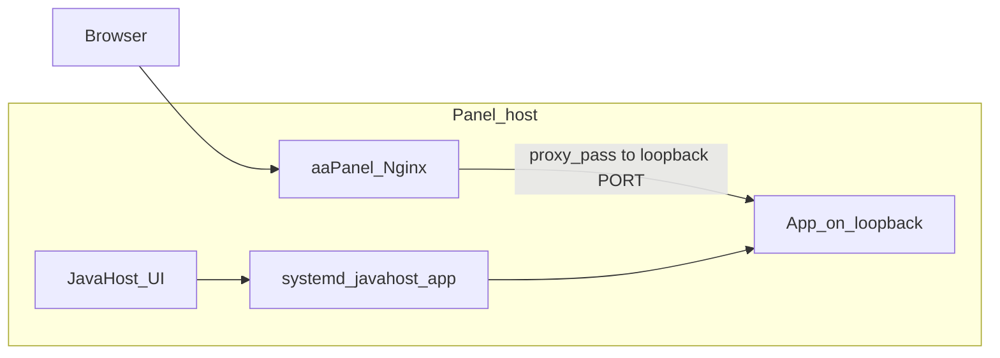
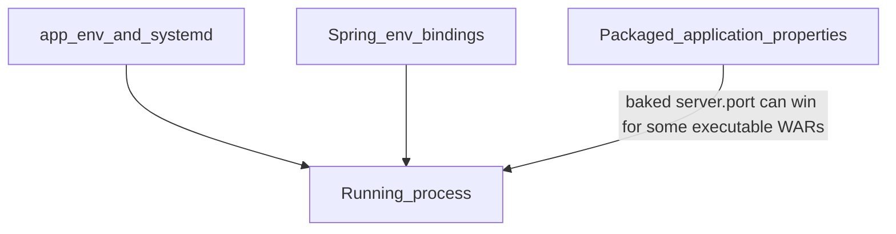
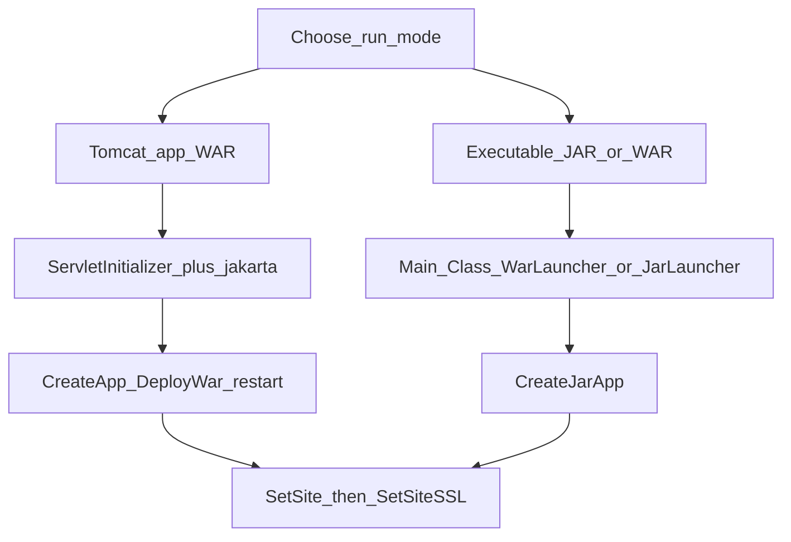
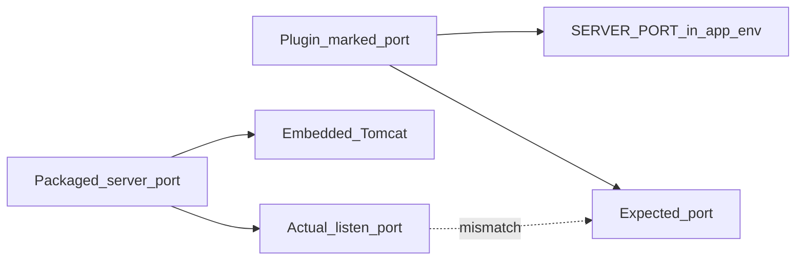
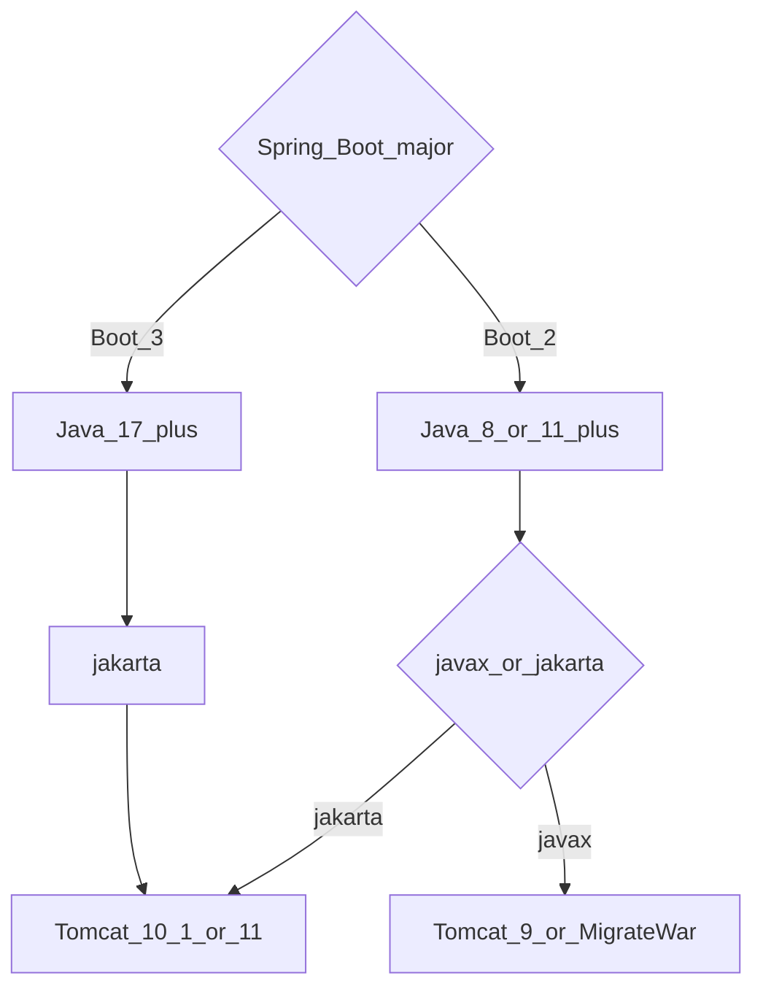
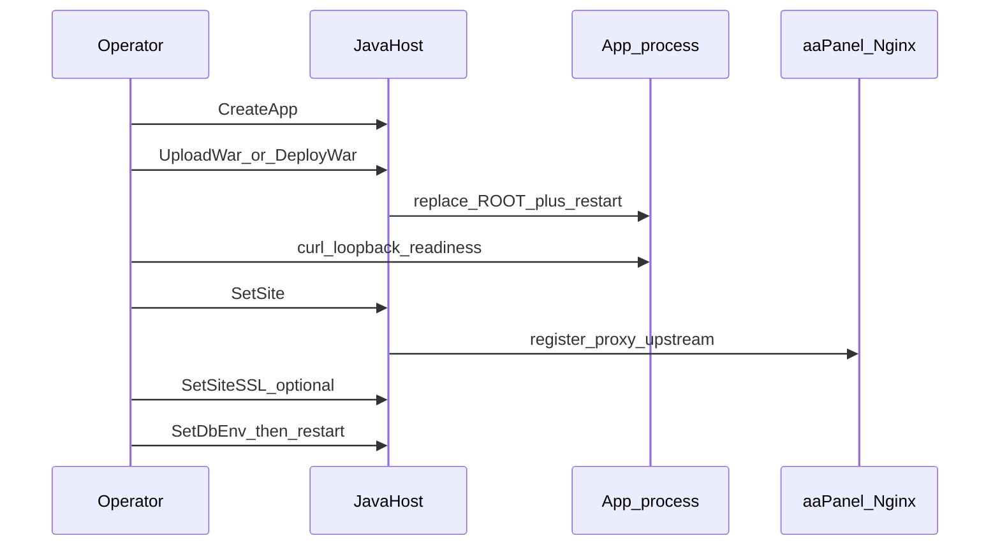

# Packaging WARs for JavaHost — developer and deployment guide

How to **build** a WAR (or Spring Boot executable WAR/JAR) that JavaHost can
run, and how to **deploy and verify** it on an aaPanel host.

**App developers:** start at *Pick a run mode*, then *Package for Tomcat* or
*Executable*, then the *Before you build* checklist.

**Panel operators:** start at *How JavaHost runs your app*, then *Operator
deploy checklist*, *Verify success honestly*, and *Troubleshooting*.

Related Help docs: User guide, Connecting Java apps to databases,
Troubleshooting.

Use placeholders only (`app.example.com`, `127.0.0.1`). Never put real panel
hostnames, IPs, or credentials in WARs, tickets, or screenshots.

---

## 1. Who this is for

**Developers** own the artifact: packaging type, Jakarta vs javax, what listens
where, which URL proves "up", and how secrets are injected.

**Operators** own the host: Tomcat/JDK line, Create app → Deploy → reverse proxy
→ SSL, `app.env`, and reading logs when a green toast is not enough.

Both need the same mental model: **JavaHost does not rewrite your WAR**. What
you bake in is what runs (plus env from `bin/app.env`).

---

## 2. How JavaHost runs your app



Key facts:

- The HTTP connector binds to **loopback only** (`127.0.0.1` plus the app port).
  Clients reach the app through an aaPanel reverse-proxy site (`SetSite`), not
  by opening the raw port on the WAN.
- Tomcat instances use **`autoDeploy=false`**. Uploading into `webapps/ROOT`
  alone does not reload the app — JavaHost **restarts** the service after a
  successful deploy.
- Deploy replaces `webapps/ROOT` **atomically** (stage → swap), then restarts.
- Config layers: systemd / `app.env` → Spring env bindings → packaged
  `application.properties` inside the WAR. JavaHost does **not** currently
  rewrite properties inside the archive.



---

## 3. Pick a run mode



**Tomcat WAR** (recommended for most web apps)

- Create a **Tomcat** app, then **Deploy WAR**.
- Artifact is extracted to `webapps/ROOT`.
- Best for classic servlets/JSPs, or Spring Boot with `SpringBootServletInitializer`.

**Executable JAR/WAR**

- Create a **JAR** app (`java -jar`).
- Needs a Manifest `Main-Class` (`JarLauncher` / `WarLauncher` or your main).
- Best for fat JARs when you accept embedded Tomcat and the port rules below.

**Insight:** Many Spring Boot projects produce an *executable WAR* (Manifest
`WarLauncher` **and** a `ServletInitializer`). Prefer **Tomcat mode** on
JavaHost unless you have a reason to keep embedded Tomcat.

---

## 4. Package a WAR for Tomcat

### Required shape

- Maven/Gradle **`packaging = war`** (not a plain JAR renamed `.war`).
- For Spring Boot: extend **`SpringBootServletInitializer`** (often named
  `ServletInitializer`) so the external container starts the context.
- After extract, JavaHost expects `WEB-INF/…` under `webapps/ROOT` (context `/`
  unless you change the Tomcat context).
- **Boot 3.x** needs **Java 17+** and **jakarta.*** → use **Tomcat 10.1 or 11**,
  not Tomcat 9.

### Do

- Keep secrets out of the WAR. Use JavaHost **Databases** → `SetDbEnv` /
  `app.env`, or Spring env overrides (`SPRING_DATASOURCE_URL`, etc.).
- Ship a **readiness URL**: `/actuator/health`, `/swagger-ui.html`,
  `/v3/api-docs`, or a tiny `/healthz`.
- Document any **host paths** (key stores, GPG dirs, uploads). Paths like
  `/app/gpg-keys` assume Docker; on a panel host they must exist where user
  `www` can read them.
- Align Redis/DB hosts with what the **panel host** can reach.

### Do not

- Rely on **`server.port`** under external Tomcat — the connector port comes
  from JavaHost’s `server.xml`.
- Treat **`/` returning 404** as a failed deploy. Many APIs have no welcome
  page.
- Leave production passwords in `application.properties`.

### Minimal Spring Boot WAR sketch

```
pom.xml: packaging=war
spring-boot-starter-web
spring-boot-starter-tomcat with scope=provided

ServletInitializer extends SpringBootServletInitializer
  configure() -> app.sources(MyApplication.class)

Optional: expose management.endpoint.health (no passwords in the file)
```

---

## 5. Package an executable JAR/WAR

### Manifest

`Main-Class` must be a Boot launcher (`JarLauncher` or `WarLauncher`) or your
own main. JavaHost’s JAR path requires an executable Manifest.

### Port ownership (important)



JavaHost writes `SERVER_PORT` into `bin/app.env` and the systemd unit.
**Some Spring Boot executable WARs still bind the packaged `server.port`** and
effectively ignore env for listening. Then the UI and reverse proxy aim at the
**marked** port while the process listens elsewhere → **connection refused**.

Workarounds today:

- Prefer **Tomcat WAR mode** (packaged `server.port` is irrelevant), or
- Remove / default `server.port` in the artifact and rely on `SERVER_PORT`, or
- Rebuild so the app honors env or `--server.port=` (operators may add a unit
  override until the plugin always passes `-Dserver.port=`).

**Insight:** systemd **`active` is not proof of the marked port**. Confirm
`Tomcat started on port …` in logs or with `ss`.

### Logs

Executable apps often log to **journald** while `instances/<app>/logs/` stays
empty. Use plugin **Logs** / **Tasks** and `journalctl -u javahost-<app>` on the
host when the file viewer is blank.

---

## 6. Tomcat / Java / namespace matrix



- Spring Boot **3.x** → jakarta → Tomcat **10.1** or **11** → Java **17+**
- Spring Boot **2.x** (javax) → Tomcat **9** (or migrate) → Java 8/11+
- Legacy `javax.servlet` WAR → Tomcat **9** or **Migrate and deploy**
- Jakarta EE 9+ WAR → Tomcat **10.1** / **11**

### Namespace detection caveat

JavaHost’s `detect_namespace` looks for `javax/servlet` / `jakarta/servlet`
paths and `web.xml` / TLD text. **Modern Boot WARs often return no namespace**:
Jakarta APIs live only inside `WEB-INF/lib/*.jar` and `web.xml` may be missing.
A missing warning does **not** mean any Tomcat is fine — pick from the matrix
(Boot 3 → Tomcat 10.1/11).

Use **Migrate and deploy** only for true `javax.*` artifacts aimed at Tomcat
10/11.

---

## 7. Operator deploy checklist



1. **Runtimes** — Install the Tomcat line and JDK from the matrix.
2. **Create app** — Tomcat app, pin Java, note the loopback port.
3. **Deploy WAR** — Prefer server-side path / staged upload; large browser
   uploads can fail with opaque `Failed to fetch`.
4. **Wait for start** — Logs should show `Started ServletInitializer` or
   `Started …Application` (Boot can take 30–60s).
5. **Loopback check** — From the host, curl your readiness path on
   `127.0.0.1` and the app port.
6. **Publish** — Settings: aaPanel **API key** if required → **SetSite** with a
   real domain → confirm Website → Reverse Proxy shows
   `http://127.0.0.1:<port>`.
7. **SSL** — Only after HTTP proxy works.
8. **Database** — Databases tab → `SetDbEnv` → restart → re-check readiness.

Use disposable app names for tests (`jhprobe…`). Do not delete unrelated
production apps.

---

## 8. Secrets and config

- **Never** hardcode DB/Redis passwords in the WAR. See Help → Connecting Java
  apps to databases.
- Prefer Spring env: `SPRING_DATASOURCE_URL`, `SPRING_DATASOURCE_USERNAME`,
  `SPRING_DATASOURCE_PASSWORD` (or map JavaHost’s `DB_*` in your code).
- Redis, SMTP, and third-party URLs must be reachable **from the panel host**.
- File/key material: document absolute paths and permissions for user `www`.

---

## 9. Publish path (proxy and SSL)

- Reverse proxy **must** target the port the process **actually** listens on
  (see port ownership above).
- Configure **Settings → aaPanel API** so `SetSite` can register a real proxy
  upstream — a site row without an upstream is not success.
- SSL is per site after HTTP works.

---

## 10. Verify success honestly

- Toast “WAR deployed” / restart requested — files swapped; app may still be
  starting or failing.
- systemd `active` — supervisor happy; not proof of the marked port.
- `Started …` in logs — context up; first request may still fail on DB.
- HTTP 200 on readiness URL — real success signal.
- `/` → 404 — often **normal** for API-only apps; not a deploy failure by itself.
- Swagger / OpenAPI 200 — useful for API WARs.
- Proxy Host header returns the same body as loopback — publish path OK.

False greens: site created but no upstream; JAR `active` while listening on a
packaged port that is not the marked port.

---

## 11. Troubleshooting

- **`/` is 404, swagger works** — No root mapping. Use the documented API or
  swagger URL for checks.
- **Everything 404, but “Started” in logs** — Wrong mappings or security; not a
  zip-slip failure if restart completed.
- **Connection refused on marked port** — Executable mode likely bound packaged
  `server.port`. Check logs; prefer Tomcat WAR mode or fix packaging.
- **GPG / directory does not exist under `/app/…`** — App expects a container
  path. Create a real host directory or reconfigure; JavaHost does not invent
  Docker volumes.
- **DB / Redis connection errors** — Fix `app.env` and network; redeploy alone
  will not fix an unreachable private IP baked into properties.
- **Namespace warning missing on Boot 3 WAR** — Known limitation; still use
  Tomcat 10.1/11 + Java 17.
- **Browser upload fails (`Failed to fetch`)** — Stage via file manager / server
  path, then Deploy WAR.
- **Slow first start** — Boot + JPA warmup can exceed 30s; wait and re-curl.

---

## 12. Quick reference checklists

### Before you build

- Packaging is `war` (Tomcat mode) or executable Manifest (JAR mode)
- Boot 3 → Java 17 + jakarta + Tomcat 10.1/11
- `ServletInitializer` present for external Tomcat
- No production secrets in `application.properties`
- Readiness path documented for operators
- Host paths for keys/files documented (no blind `/app/...`)

### Before you upload

- Correct Tomcat line + JDK installed
- Disposable app name for tests
- DB/Redis reachable from the host (or deferred until `SetDbEnv`)
- Know the readiness URL (not only `/`)

### After deploy

- Logs show Started / no fatal startup stack
- curl readiness on loopback and the **actual** listen port
- Listen port matches UI (especially JAR mode)
- `SetSite` proxy upstream correct
- SSL only after HTTP works
- `SetDbEnv` + restart if the app needs a database

---

## 13. What JavaHost does and does not do

**Does:** install Tomcat/JDK; per-app `CATALINA_BASE` and systemd; zip-slip-safe
WAR extract with atomic ROOT replace and restart; optional javax→jakarta
migrate; secret-safe `app.env`; aaPanel reverse proxy and SSL helpers; logs and
tasks in the UI.

**Does not (today):** rewrite packaged `application.properties`; always force
embedded Boot onto the marked port via `--server.port`; auto-detect every
controller route or invent a homepage; mount Docker-style volumes; guarantee
namespace detection on Boot fat WARs without `web.xml`.
